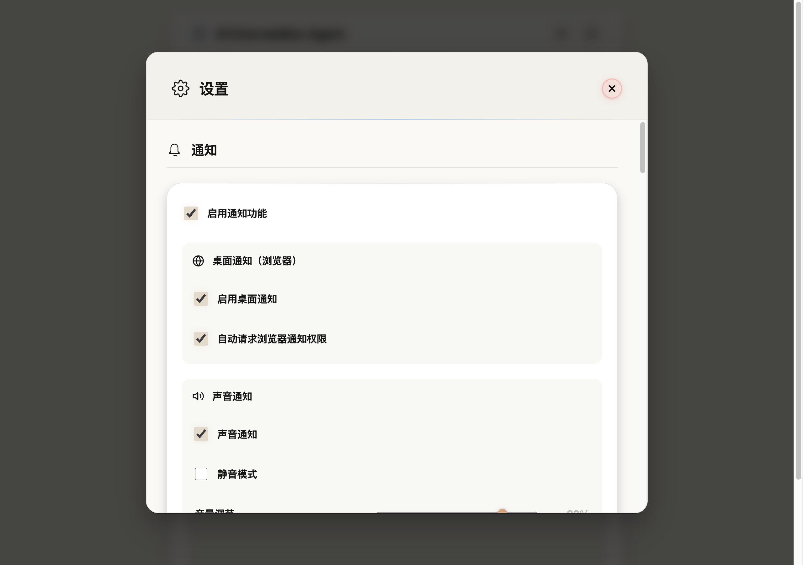
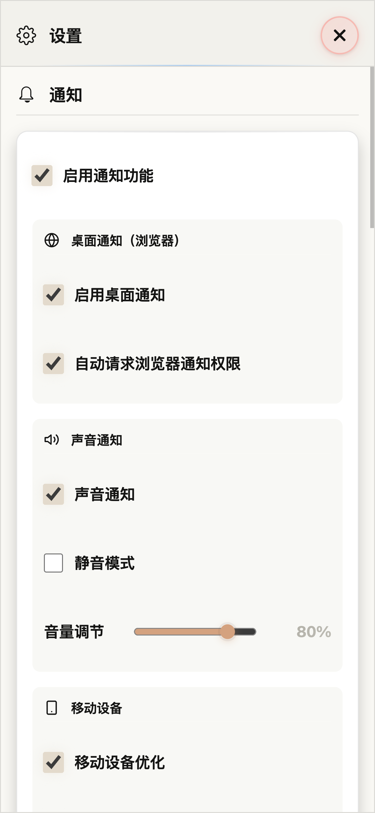
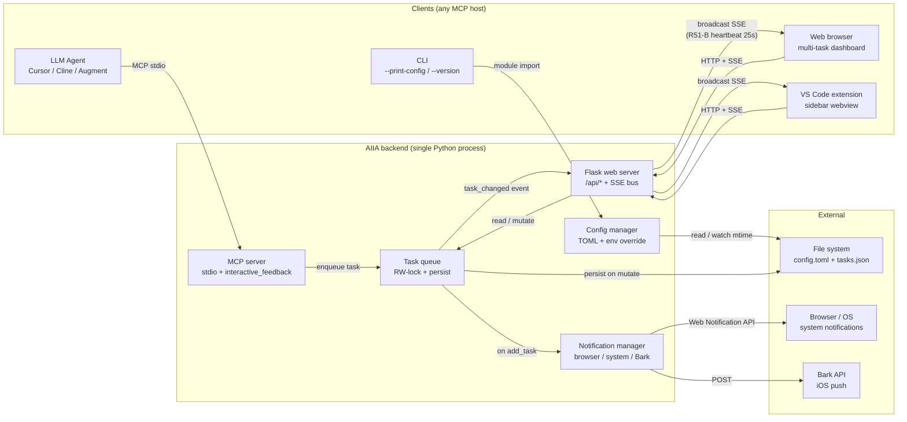
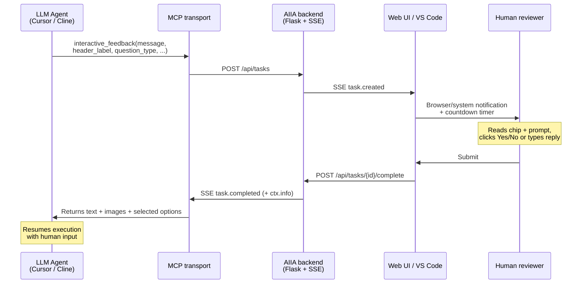
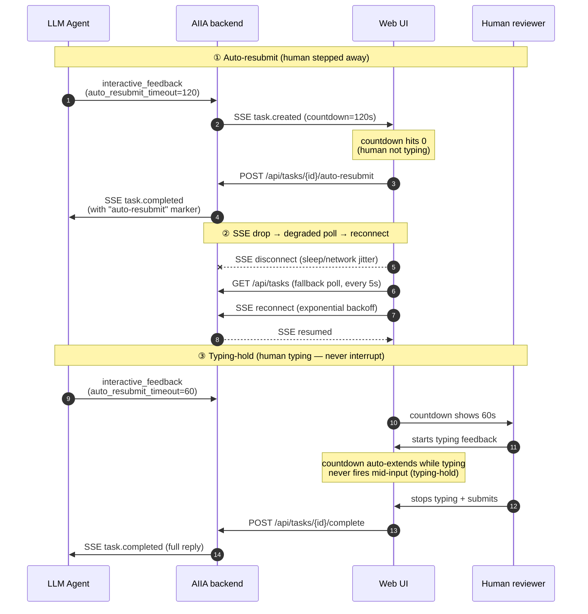

<div align="center">
  <a href="https://github.com/xiadengma/ai-intervention-agent">
    
  </a>

  <h2>AI Intervention Agent</h2>

  <p><strong>Real-time user intervention for MCP agents — pause, course-correct, resume.</strong></p>

  <p>
    <a href="https://pypi.org/project/ai-intervention-agent/">
      
    </a>
    <a href="https://modelcontextprotocol.io">
      
    </a>
    <a href="https://github.com/xiadengma/ai-intervention-agent/blob/main/LICENSE">
      
    </a>
  </p>

  <p>
    English | <a href="./README.zh-CN.md">简体中文</a>
  </p>
</div>

---

Ever had your AI agent confidently walk off in the wrong direction mid-task? AI Intervention Agent gives you a Web UI to **pause** the agent at key moments, review what it's about to do, type a course-correction, attach screenshots, and **resume** — all through the MCP `interactive_feedback` tool, without ending the conversation.

Works with `Cursor`, `VS Code`, `Claude Code`, `Augment`, `Windsurf`, `Trae`, and more.

## Quick start

### Quickest: ask your AI to install it for you

If your IDE/CLI has an AI agent (Cursor, Claude Code, VS Code, Windsurf, Trae, Augment, ...), paste the prompt below in chat and let it write the config for you.

<details>
<summary>Click to copy the install prompt</summary>

```text
Please configure my IDE / AI tool to use the `ai-intervention-agent` MCP server:

1. Locate the correct MCP config file for my current IDE
   (e.g. `.cursor/mcp.json` or `~/.cursor/mcp.json` for Cursor,
    `~/.claude.json` for Claude Code,
    `.vscode/mcp.json` for VS Code).
2. Add this entry under `mcpServers`:
   - command: `uvx`
   - args: `["ai-intervention-agent"]`
   - timeout: 600
   - autoApprove: `["interactive_feedback"]`
3. Append the project's recommended prompt rules
   (the "Prompt snippet (copy/paste)" block in this README)
   to my agent rules / system prompt, so the agent always asks me
   through `interactive_feedback` instead of ending tasks silently.
4. Verify by listing MCP servers and confirming `ai-intervention-agent` is loaded.
```

</details>

### Option 1: Using `uvx` (Recommended)

[](https://cursor.com/en/install-mcp?name=ai-intervention-agent&config=eyJjb21tYW5kIjoidXZ4IiwiYXJncyI6WyJhaS1pbnRlcnZlbnRpb24tYWdlbnQiXSwidGltZW91dCI6NjAwLCJhdXRvQXBwcm92ZSI6WyJpbnRlcmFjdGl2ZV9mZWVkYmFjayJdfQ%3D%3D)
[](https://vscode.dev/redirect?url=vscode%3Amcp%2Finstall%3F%257B%2522name%2522%253A%2522ai-intervention-agent%2522%252C%2522command%2522%253A%2522uvx%2522%252C%2522args%2522%253A%255B%2522ai-intervention-agent%2522%255D%252C%2522timeout%2522%253A600%252C%2522autoApprove%2522%253A%255B%2522interactive_feedback%2522%255D%257D)

Configure your AI tool to launch the MCP server directly via `uvx` (this automatically installs and runs the latest version):

```json
{
  "mcpServers": {
    "ai-intervention-agent": {
      "command": "uvx",
      "args": ["ai-intervention-agent"],
      "timeout": 600,
      "autoApprove": ["interactive_feedback"]
    }
  }
}
```

### Option 2: Using `pip`

1. First, install the package manually (please remember to manually `pip install --upgrade ai-intervention-agent` periodically to get updates):

```bash
pip install ai-intervention-agent
```

2. Configure your AI tool to launch the installed MCP server:

```json
{
  "mcpServers": {
    "ai-intervention-agent": {
      "command": "ai-intervention-agent",
      "args": [],
      "timeout": 600,
      "autoApprove": ["interactive_feedback"]
    }
  }
}
```

> [!NOTE]
> `interactive_feedback` is a **long-running tool**. Some clients have a hard request timeout, so the Web UI provides a countdown + auto re-submit option to keep sessions alive.
>
> - Default: `feedback.frontend_countdown=240` seconds
> - Range: `0` (disabled) or `[10, 3600]` seconds. The default 240 stays
>   under the common 300s session hard timeout; raise it intentionally
>   when your client allows longer turns.

3. (Optional) Customize your config:

- On first run, `config.toml` will be created under your OS user config directory (see [docs/configuration.md](docs/configuration.md)).
- Example:

```toml
[web_ui]
port = 8080

[feedback]
frontend_countdown = 240
backend_max_wait = 600
```

<details>
<summary>Prompt snippet (copy/paste)</summary>

```text
- Only ask me through the MCP `ai-intervention-agent` tool; do not ask directly in chat or ask for end-of-task confirmation in chat.
- If a tool call fails, keep asking again through `ai-intervention-agent` instead of making assumptions, until the tool call succeeds.

ai-intervention-agent usage details:

- If requirements are unclear, use `ai-intervention-agent` to ask for clarification with predefined options.
- If there are multiple approaches, use `ai-intervention-agent` to ask instead of deciding unilaterally.
- If a plan/strategy needs to change, use `ai-intervention-agent` to ask instead of deciding unilaterally.
- Before finishing a request, always ask for feedback via `ai-intervention-agent`.
- Do not end the conversation/request unless the user explicitly allows it via `ai-intervention-agent`.
```

</details>

## Screenshots

<p align="center">
  <picture>
    <source media="(prefers-color-scheme: dark)" srcset=".github/assets/desktop_dark_content.png">
    
  </picture>
  <picture>
    <source media="(prefers-color-scheme: dark)" srcset=".github/assets/mobile_dark_content.png">
    
  </picture>
</p>

<p align="center"><sub>Feedback page · auto switches between dark/light · multi-task tabs with independent countdowns</sub></p>

<details>
<summary>More screenshots (empty state + settings)</summary>

<p align="center">
  <picture>
    <source media="(prefers-color-scheme: dark)" srcset=".github/assets/desktop_dark_no_content.png">
    
  </picture>
  <picture>
    <source media="(prefers-color-scheme: dark)" srcset=".github/assets/mobile_dark_no_content.png">
    
  </picture>
</p>

<p align="center"><sub>Empty state · waiting for the next interactive request</sub></p>

<p align="center">
  <picture>
    <source media="(prefers-color-scheme: dark)" srcset=".github/assets/desktop_dark_settings.png">
    
  </picture>
  <picture>
    <source media="(prefers-color-scheme: dark)" srcset=".github/assets/mobile_dark_settings.png">
    
  </picture>
</p>

<p align="center"><sub>Settings · notifications · Bark · sound · feedback countdown · auto switches between dark/light</sub></p>

</details>

## Key features

- ⚡ **Real-time intervention** — the agent pauses and waits for your input via `interactive_feedback`
- 🖥️ **Web UI** — Markdown, code highlighting, and math rendering out of the box
- 🗂️ **Multi-task tabs** — switch between concurrent requests, each with its own countdown
- 🔁 **Auto re-submit** — keep long sessions alive past client hard timeouts; at zero your typed text and checked options are submitted, never an empty prompt
- ⏱️ **Typing-hold** — the countdown auto-extends while you type and never fires mid-input (web page and VS Code extension alike)
- 🔔 **Notifications** — web / sound / system / Bark, plus custom notification sound upload
- 🌐 **SSH / LAN friendly** — works behind port forwarding; mDNS publishes a `<host>.local` URL when supported
- 🏷️ **Header chips & Yes/No buttons** — per-task `header_label` context chip, or `question_type='yesno'` for one-click binary decisions
- 🎨 **Custom placeholder hints** — per-task `feedback_placeholder` overrides the textarea hint
- 🌏 **i18n** — Web UI + VS Code extension shipped in `en` / `zh-CN` / `zh-TW`
- ⚡ **Productivity shortcuts** — keyboard cheatsheet (press `?`), per-task draft autosave, configurable submit mode, live character counter
- 💬 **Quick reply phrases** — save / reuse canned responses with JSON export + import
- 🟢 **SSE liveness indicator** — 3-state corner badge shows whether the page is in sync with the backend
- 📱 **PWA + offline-aware** — installable from the browser's native menu; a branded offline page with auto-recovery replaces the default error screen
- ♿ **WCAG 2.1 AA accessible** — contrast, Name/Role/Value, focus management, `prefers-reduced-motion` / `prefers-contrast: more` all audited and locked by invariant tests
- 🛡️ **Stable install** — built on Flask 3.x with conservative dependency pins; immune to the [Starlette 1.0 breaking change](https://github.com/Minidoracat/mcp-feedback-enhanced/issues/213) that broke several MCP feedback servers in early 2026

> Architecture diagram, "how it works" flow, production middleware chain,
> server self-info resource, and MCP-spec compliance details live under
> [`docs/api/index.md`](docs/api/index.md) and
> [`docs/mcp_tools.md`](docs/mcp_tools.md).

## Architecture overview

A bird's-eye view of how AIIA's components fit together — useful when
you're integrating a new client (custom MCP host, alternate IDE plugin)
or debugging a cross-component issue.


```mermaid
graph LR
    subgraph Clients["Clients (any MCP host)"]
        A1[LLM Agent<br/>Cursor / Cline / Augment]
        A2[Web browser<br/>multi-task dashboard]
        A3[VS Code extension<br/>sidebar webview]
        A4[CLI<br/>--print-config / --version]
    end

    subgraph Backend["AIIA backend (single Python process)"]
        B1[MCP server<br/>stdio + interactive_feedback]
        B2[Flask web server<br/>/api/* + SSE bus]
        B3[Task queue<br/>RW-lock + persist]
        B4[Notification manager<br/>browser / system / Bark]
        B5[Config manager<br/>TOML + env override]
    end

    subgraph External["External"]
        E1[File system<br/>config.toml + tasks.json]
        E2[Browser / OS<br/>system notifications]
        E3[Bark API<br/>iOS push]
    end

    A1 -- MCP stdio --> B1
    A2 -- HTTP + SSE --> B2
    A3 -- HTTP + SSE --> B2
    A4 -- module import --> B5

    B1 -- enqueue task --> B3
    B2 -- read / mutate --> B3
    B3 -- task_changed event --> B2
    B2 -- "broadcast SSE<br/>(R51-B heartbeat 25s)" --> A2
    B2 -- broadcast SSE --> A3
    B3 -- on add_task --> B4
    B4 -- "Web Notification API" --> E2
    B4 -- POST --> E3
    B5 -- read / watch mtime --> E1
    B3 -- persist on mutate --> E1
```

**Key invariants** (locked by tests in `tests/`):
- `task_changed` SSE payload schema enforced cross-language
  (Python ↔ JS, `test_feat_sse_cross_language_schema_r297.py`).
- SSE heartbeat = 25s, cleanup interval = 5s, hot-path throttle = 30s,
  JS health check = 30s — locked across all source files
  (`test_feat_perf_baseline_const_r296.py`).
- Plus a static single-tool MCP surface, AST-based lock-acquisition-order
  contracts (deadlock-freedom proven statically), and a lazy-init audit —
  see [`docs/contributor-guide-invariant-tests.md`](docs/contributor-guide-invariant-tests.md)
  for the full catalogue.

For deeper subsystem detail (config schema, MCP tool reference,
i18n strategy, troubleshooting), follow the links in
[`Documentation`](#documentation) below.

## Agent / Glass mode workflow

AIIA is designed for **long-running autonomous agent loops** (Cursor
Composer, Cursor Glass mode, Cline, Augment, Trae) where the LLM calls
`interactive_feedback` many times during a single run. The combined
agent-side parameters + user-side UX features below let a human reviewer
decide in **< 5 seconds per task**, so the agent never blocks the
flow longer than necessary.

### How a single interaction flows


```mermaid
sequenceDiagram
    participant Agent as LLM Agent<br/>(Cursor / Cline)
    participant MCP as MCP transport
    participant AIIA as AIIA backend<br/>(Flask + SSE)
    participant UI as Web UI / VS Code
    participant Human as Human reviewer

    Agent->>MCP: interactive_feedback(message,<br/>header_label, question_type, ...)
    MCP->>AIIA: POST /api/tasks
    AIIA->>UI: SSE task.created
    UI->>Human: Browser/system notification<br/>+ countdown timer
    Note over Human: Reads chip + prompt,<br/>clicks Yes/No or types reply
    Human->>UI: Submit
    UI->>AIIA: POST /api/tasks/{id}/complete
    AIIA->>MCP: SSE task.completed (+ ctx.info)
    MCP->>Agent: Returns text + images + selected options
    Note over Agent: Resumes execution<br/>with human input
```

### Failure & recovery flows

Beyond the happy path above, three boundary cases keep long-running
Agent / Glass-mode sessions resilient: **auto-resubmit** (human steps
away), **SSE reconnect** (network drop), and **typing-hold** (human is
typing — never interrupt).


```mermaid
sequenceDiagram
    autonumber
    participant Agent as LLM Agent
    participant AIIA as AIIA backend
    participant UI as Web UI
    participant Human as Human reviewer

    Note over Agent,Human: ① Auto-resubmit (human stepped away)
    Agent->>AIIA: interactive_feedback<br/>(auto_resubmit_timeout=120)
    AIIA->>UI: SSE task.created (countdown=120s)
    Note over UI: countdown hits 0<br/>(human not typing)
    UI->>AIIA: POST /api/tasks/{id}/auto-resubmit
    AIIA->>Agent: SSE task.completed<br/>(with "auto-resubmit" marker)

    Note over UI,AIIA: ② SSE drop → degraded poll → reconnect
    UI--xAIIA: SSE disconnect (sleep/network jitter)
    UI->>AIIA: GET /api/tasks (fallback poll, every 5s)
    UI->>AIIA: SSE reconnect (exponential backoff)
    AIIA-->>UI: SSE resumed

    Note over Agent,Human: ③ Typing-hold (human typing — never interrupt)
    Agent->>AIIA: interactive_feedback<br/>(auto_resubmit_timeout=60)
    UI->>Human: countdown shows 60s
    Human->>UI: starts typing feedback
    Note over UI: countdown auto-extends while typing<br/>never fires mid-input (typing-hold)
    Human->>UI: stops typing + submits
    UI->>AIIA: POST /api/tasks/{id}/complete
    AIIA->>Agent: SSE task.completed (full reply)
```

### Agent-side parameters (LLM passes these via MCP)

| Parameter | Purpose | Max | Source |
|---|---|---|---|
| `header_label` | One-word context chip in task pane (`Auth`, `DB`, `i18n`) | 16 chars | gemini-cli `ask_user.header` |
| `question_type='yesno'` | Hide textarea + render 2-button binary decision | — | gemini-cli `ask_user` |
| `feedback_placeholder` | Per-task textarea hint (overrides global i18n) | 200 chars | gemini-cli `ask_user` |
| `auto_resubmit_timeout` | Per-task countdown override (0 = disable) | `[0, 3600]` sec | AIIA native |
| `predefined_options` | Multi-select chips with optional `default: true` recommendation | 10000 chars/each | AIIA + upstream parity |
| `loop_id` + 4 loop fields | Group multi-round feedback into one loop: objective, phase, success criteria, iteration label | 32–500 chars | AIIA loop engineering |

Full parameter reference + a complete Agent-mode call example lives in
[`docs/mcp_tools.md#agent-mode-parameters-cursor--composer--cline--augment--trae`](docs/mcp_tools.md#agent-mode-parameters-cursor--composer--cline--augment--trae).

**Loop engineering** (long autonomous runs): rounds sharing a `loop_id`
render a loop-context strip above the prompt and a collapsible "Rounds"
timeline of every completed round's verdict, backed by `GET /api/loops`.
See [`docs/mcp_tools.md#loop-engineering-parameters-long-autonomous-runs`](docs/mcp_tools.md#loop-engineering-parameters-long-autonomous-runs).

### User-side workflow features (built into the Web UI)

- **Multi-task tabs** — parallel requests each get their own tab +
  independent countdown ring
- **Per-task draft autosave** — switching tabs never loses an
  in-progress reply
- **Typing-hold auto-extension** — the countdown extends itself while
  you type and never fires mid-input
- **Quick reply phrases** — canned replies saved to `localStorage`,
  one-click insert
- **Custom notification sound** — upload a short audio file for a
  distinct Agent-mode chime
- **Per-task images** — paste screenshots inline, returned to the agent
  as MCP `ImageContent` blocks
- **SSE liveness badge** — green/orange/red corner indicator shows
  whether the page is in sync

### Recommended LLM system prompt

To force the agent to actually use this tool instead of "auto-finishing"
the task, append the snippet under [`Prompt snippet (copy/paste)`](#option-1-using-uvx-recommended)
to your IDE's system prompt / `.cursorrules`.

## VS Code extension (optional)

<p>
  <a href="https://open-vsx.org/extension/xiadengma/ai-intervention-agent">
    
  </a>
  <a href="https://open-vsx.org/extension/xiadengma/ai-intervention-agent">
    
  </a>
  <a href="https://open-vsx.org/extension/xiadengma/ai-intervention-agent">
    
  </a>
</p>

| Item                           | Value                                                                                                                                                                                                                                                                                                                          |
| ------------------------------ | ------------------------------------------------------------------------------------------------------------------------------------------------------------------------------------------------------------------------------------------------------------------------------------------------------------------------------ |
| Purpose                        | Embed the interaction panel into VS Code’s sidebar to avoid switching to a browser.                                                                                                                                                                                                                                            |
| Install (Open VSX)             | [Open VSX](https://open-vsx.org/extension/xiadengma/ai-intervention-agent)                                                                                                                                                                                                                                                     |
| Download VSIX (GitHub Release) | [GitHub Releases](https://github.com/xiadengma/ai-intervention-agent/releases/latest)                                                                                                                                                                                                                                          |
| Setting                        | `ai-intervention-agent.serverUrl` (should match your Web UI URL, e.g. `http://localhost:8080`; you can change `web_ui.port` in [`config.toml.default`](config.toml.default))                                                                                                                                                   |
| Other settings                 | `ai-intervention-agent.logLevel` (Output → AI Intervention Agent). macOS native notifications are enabled by default and can be toggled in the sidebar's **Notification Settings** panel. See [`packages/vscode/README.md`](packages/vscode/README.md) for the full settings list and the AppleScript executor security model. |

## Configuration

| Item             | Value                                                                                          |
| ---------------- | ---------------------------------------------------------------------------------------------- |
| Docs (English)   | [docs/configuration.md](docs/configuration.md)                                                 |
| Docs (简体中文)  | [docs/configuration.zh-CN.md](docs/configuration.zh-CN.md)                                     |
| Default template | [`config.toml.default`](config.toml.default) (on first run it will be copied to `config.toml`) |

| OS      | User config directory                                  |
| ------- | ------------------------------------------------------ |
| Linux   | `~/.config/ai-intervention-agent/`                     |
| macOS   | `~/Library/Application Support/ai-intervention-agent/` |
| Windows | `%APPDATA%/ai-intervention-agent/`                     |

### Quick overrides (no file edits required)

For `uvx`, Docker, systemd, or SSH-remote runtimes where editing
`config.toml` is awkward, the most-used `web_ui` settings can be
overridden by env var at process startup:

```bash
export AI_INTERVENTION_AGENT_WEB_UI_HOST=0.0.0.0      # default 127.0.0.1
export AI_INTERVENTION_AGENT_WEB_UI_PORT=8181         # default 8080, range [1, 65535]
export AI_INTERVENTION_AGENT_WEB_UI_LANGUAGE=en       # auto / en / zh-CN / zh-TW
uvx ai-intervention-agent
```

Invalid values log a `WARNING` and fall back to `config.toml`/defaults
so a typo never blocks server startup. See
[`docs/configuration.md#environment-variable-overrides`](docs/configuration.md#environment-variable-overrides)
for the full surface (timeouts, log level, etc.).

### CLI inspection

```bash
ai-intervention-agent --version       # or -V — print version and exit
ai-intervention-agent --help          # or -h — show usage + config hints
ai-intervention-agent --print-config  # dump effective merged config + env overrides
```

`--print-config` answers _"is my port 8181 because of env, or `config.toml`?"_
in one shell pipeline — output is JSON (`jq` friendly) with the loaded
config path, resolved sections (secret-like fields auto-redacted), and
active env overrides. `network_security` is filtered out at the
`ConfigManager.get_all()` boundary (same trust level as
[`/api/system/health`](docs/configuration.md#environment-variable-overrides)).

## Documentation

- **Docs index** (by audience): [`docs/README.md`](docs/README.md) · [`docs/README.zh-CN.md`](docs/README.zh-CN.md)
- **Scripts index** (CI gates / generators / QA): [`scripts/README.md`](scripts/README.md)
- **Release notes**: [`CHANGELOG.md`](CHANGELOG.md) · VS Code marketplace listing: [`packages/vscode/CHANGELOG.md`](packages/vscode/CHANGELOG.md)
- **Contributing**: [`CONTRIBUTING.md`](.github/CONTRIBUTING.md) · [`CODE_OF_CONDUCT.md`](.github/CODE_OF_CONDUCT.md)
- **API docs index**: [`docs/api/index.md`](docs/api/index.md)
- **API docs (简体中文)**: [`docs/api.zh-CN/index.md`](docs/api.zh-CN/index.md)
- **MCP tool reference**: [`docs/mcp_tools.md`](docs/mcp_tools.md)
- **MCP 工具说明**: [`docs/mcp_tools.zh-CN.md`](docs/mcp_tools.zh-CN.md)
- **Troubleshooting / FAQ**: [`docs/troubleshooting.md`](docs/troubleshooting.md) · [`docs/troubleshooting.zh-CN.md`](docs/troubleshooting.zh-CN.md)
- **Release recovery runbook**: [`docs/release-recovery.md`](docs/release-recovery.md) · [`docs/release-recovery.zh-CN.md`](docs/release-recovery.zh-CN.md)
- **i18n contributor guide**: [`docs/i18n.md`](docs/i18n.md)
- **DeepWiki Q&A** — AI-augmented Q&A over the repo: <a href="https://deepwiki.com/xiadengma/ai-intervention-agent"></a>

## Related projects

| Project | Stars (approx.) | Focus |
| --- | --- | --- |
| [mcp-feedback-enhanced](https://github.com/Minidoracat/mcp-feedback-enhanced) (Minidoracat) | ~3.8k | Largest sibling; Web UI + Tauri desktop app, auto-command execution, SSH Remote / WSL detection. |
| [cunzhi](https://github.com/imhuso/cunzhi) (imhuso) | ~1.4k | Chinese-language project focused on preventing premature task completion. |
| [Relay](https://glama.ai/mcp/servers/andeya/ide-relay-mcp) (andeya) | new | Multi-IDE relay, multi-tab session merging, native desktop window, Cursor usage monitoring. |
| [interactive-feedback-mcp (Node.js)](https://github.com/wellcomemayhem-spec/interactive-feedback-mcp-nodejs) | new | Node.js port with WebSocket UI and Speech-to-Text via OpenAI Whisper. |
| [interactive-feedback-mcp](https://github.com/junanchn/interactive-feedback-mcp) (junanchn) | ~50 | Win32-native always-on-top window, auto-reply rules. |
| [interactive-feedback-mcp](https://github.com/poliva/interactive-feedback-mcp) (poliva) | ~310 | Direct ancestor fork (see Acknowledgements); minimal Python MCP, single feedback dialog. |
| [interactive-feedback-mcp](https://github.com/Pursue-LLL/interactive-feedback-mcp) (Pursue-LLL) | ~30 | Independent smaller-scale fork emphasising minimal dependencies. |

**Where AIIA sits on the spectrum**: AIIA targets the operationally deep end — Web UI + VS Code extension sharing one backend, production-grade observability (`/metrics` Prometheus endpoint + a [reference Grafana dashboard](docs/observability/README.md)), bilingual i18n + docs, strict invariant test discipline (8,200+ tests + 1,050+ subtests across 40 audit cycles), and a 5-job release pipeline. Want the smallest drop-in? poliva's fork. A desktop app? mcp-feedback-enhanced. Voice / multi-tab UI? Relay or the Node.js fork. Full-stack operational integration? AIIA.

**Feature gap callouts** (contributions welcome): Speech-to-Text input, always-on-top native window, Cursor usage monitoring, multi-tab session merging UI.

> Star counts are approximate snapshots (last reviewed 2026-06); check each upstream for current numbers. Submit a PR if you'd like another related project listed.

## Acknowledgements

This project's heritage traces back to **Fábio Ferreira** (2024) and **Pau Oliva** (2025), whose original [`noopstudios/interactive-feedback-mcp`](https://github.com/noopstudios/interactive-feedback-mcp) and [`poliva/interactive-feedback-mcp`](https://github.com/poliva/interactive-feedback-mcp) seeded the MCP `interactive_feedback` tool surface. Their copyright notices are preserved in [`LICENSE`](LICENSE) per the MIT license terms. The v1.5.x line is a substantial rewrite — Web UI, VS Code extension, i18n, notification stack, CI/CD pipeline — owned and maintained by [@xiadengma](https://github.com/xiadengma) (PyPI / Open VSX / VS Code Marketplace publisher).

## License

MIT License

---

<details>
<summary><strong>Quality & Security</strong></summary>

<br />

<p>
  <a href="https://github.com/xiadengma/ai-intervention-agent/actions/workflows/test.yml">
    
  </a>
  <a href="https://github.com/xiadengma/ai-intervention-agent/actions/workflows/scorecard.yml">
    
  </a>
  <a href="https://www.python.org/downloads/">
    
  </a>
</p>

- **Tests** — GitHub Actions test workflow status (runs on every push / PR)
- **OpenSSF Scorecard** — supply-chain security posture
- **Python versions** — supported runtime compatibility (declared in `pyproject.toml`)

</details>
