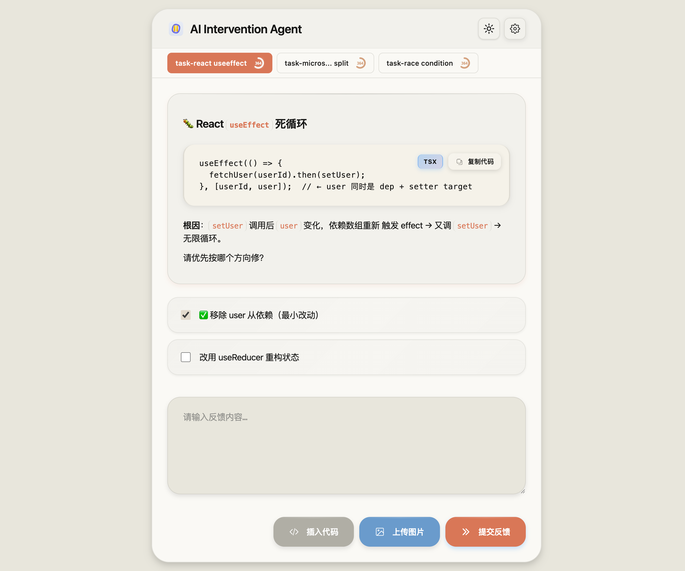
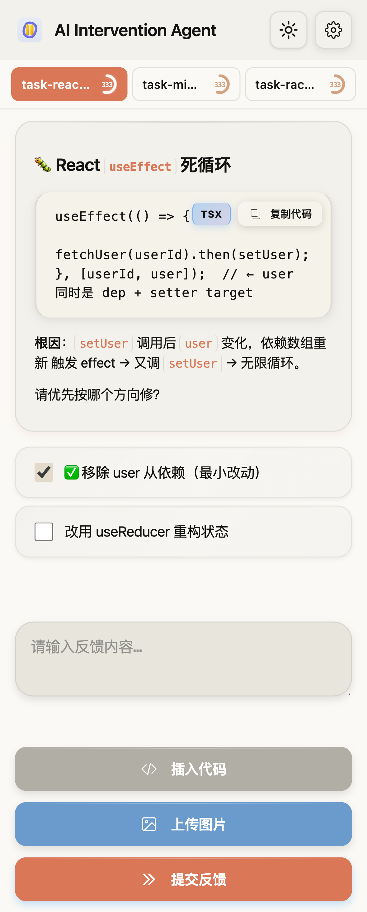
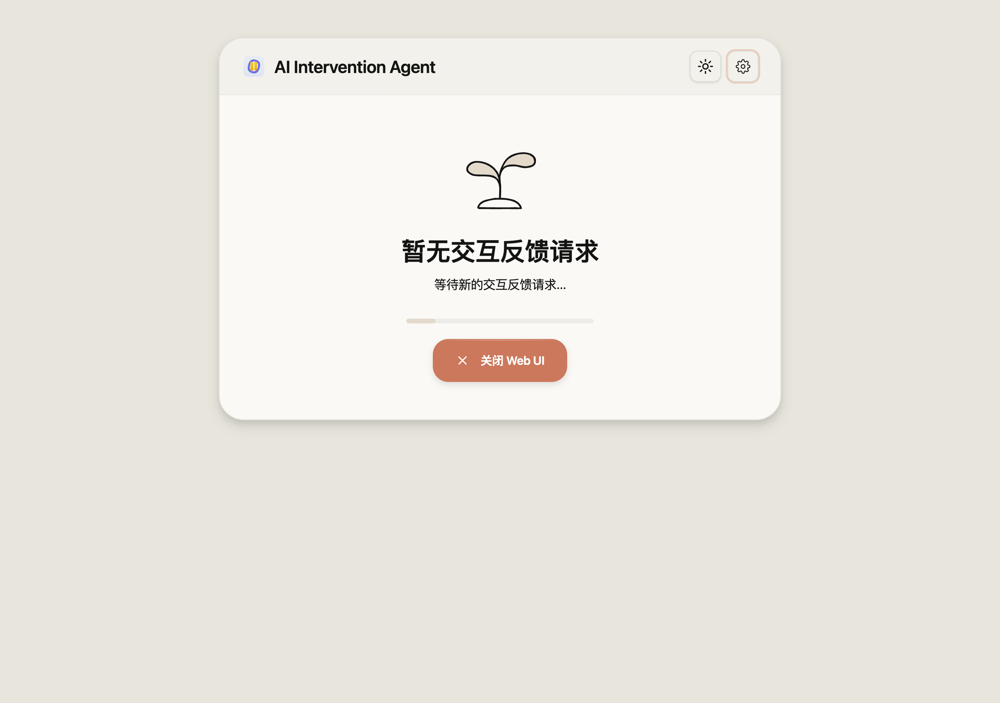
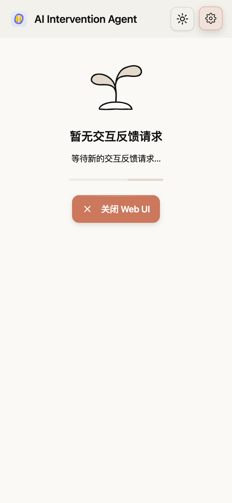
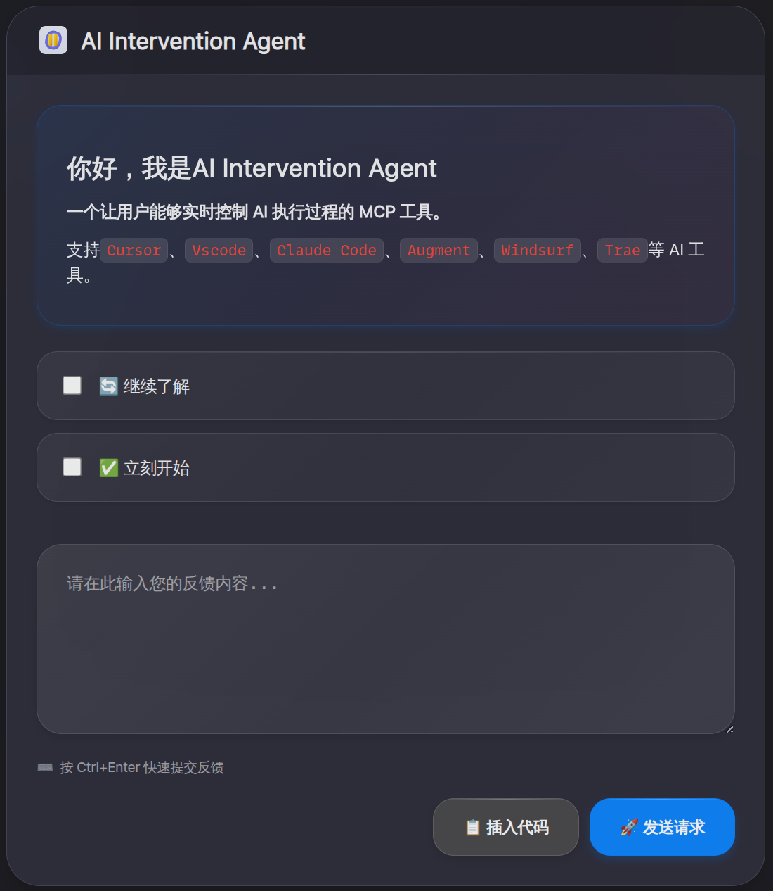
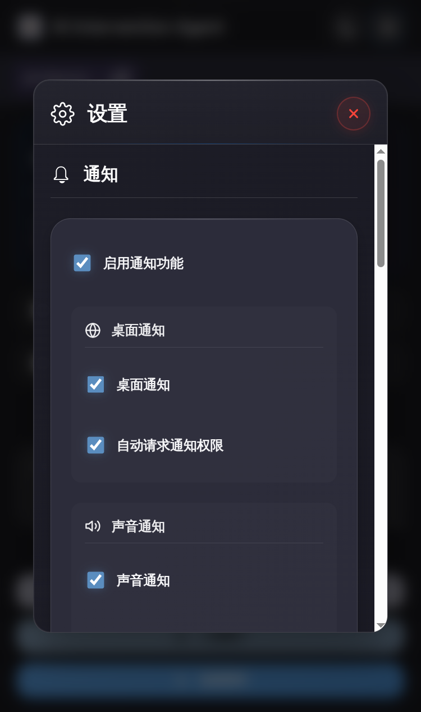
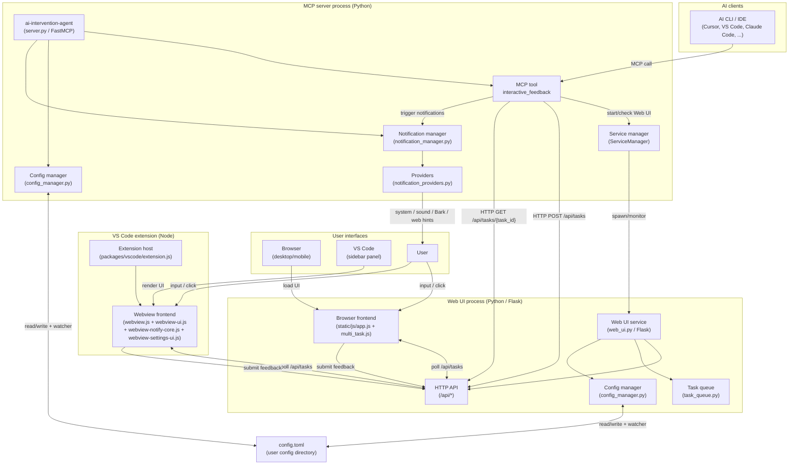

<div align="center">
  <a href="https://github.com/xiadengma/ai-intervention-agent">
    
  </a>

  <h2>AI Intervention Agent</h2>

  <p><strong>Real-time user intervention for MCP agents.</strong></p>

  <p>
    <a href="https://github.com/xiadengma/ai-intervention-agent/actions/workflows/test.yml">
      
    </a>
    <a href="https://github.com/xiadengma/ai-intervention-agent/actions/workflows/scorecard.yml">
      
    </a>
    <a href="https://pypi.org/project/ai-intervention-agent/">
      
    </a>
    <a href="https://www.python.org/downloads/">
      
    </a>
    <a href="https://open-vsx.org/extension/xiadengma/ai-intervention-agent">
      
    </a>
    <a href="https://open-vsx.org/extension/xiadengma/ai-intervention-agent">
      
    </a>
    <a href="https://open-vsx.org/extension/xiadengma/ai-intervention-agent">
      
    </a>
    <a href="https://deepwiki.com/xiadengma/ai-intervention-agent">
      
    </a>
    <a href="https://github.com/xiadengma/ai-intervention-agent/blob/main/LICENSE">
      
    </a>
  </p>

  <p>
    English | <a href="./README.zh-CN.md">简体中文</a>
  </p>
</div>

When using AI CLIs/IDEs, agents can drift from your intent. This project gives you a simple way to **intervene** at key moments, review context in a Web UI, and send your latest instructions via `interactive_feedback` so the agent can continue on track.

Works with `Cursor`, `VS Code`, `Claude Code`, `Augment`, `Windsurf`, `Trae`, and more.

## Quick start

### Option 1: Using `uvx` (Recommended)

[](https://cursor.com/en/install-mcp?name=ai-intervention-agent&config=eyJjb21tYW5kIjoidXZ4IiwiYXJncyI6WyJhaS1pbnRlcnZlbnRpb24tYWdlbnQiXSwidGltZW91dCI6NjAwLCJhdXRvQXBwcm92ZSI6WyJpbnRlcmFjdGl2ZV9mZWVkYmFjayJdfQ%3D%3D)
[](https://vscode.dev/redirect?url=vscode%3Amcp%2Finstall%3F%257B%2522name%2522%253A%2522ai-intervention-agent%2522%252C%2522command%2522%253A%2522uvx%2522%252C%2522args%2522%253A%255B%2522ai-intervention-agent%2522%255D%252C%2522timeout%2522%253A600%252C%2522autoApprove%2522%253A%255B%2522interactive_feedback%2522%255D%257D)

Configure your AI tool to launch the MCP server directly via `uvx` (this automatically installs and runs the latest version):

```json
{
  "mcpServers": {
    "ai-intervention-agent": {
      "command": "uvx",
      "args": ["ai-intervention-agent"],
      "timeout": 600,
      "autoApprove": ["interactive_feedback"]
    }
  }
}
```

### Option 2: Using `pip`

1. First, install the package manually (please remember to manually `pip install --upgrade ai-intervention-agent` periodically to get updates):

```bash
pip install ai-intervention-agent
```

2. Configure your AI tool to launch the installed MCP server:

```json
{
  "mcpServers": {
    "ai-intervention-agent": {
      "command": "ai-intervention-agent",
      "args": [],
      "timeout": 600,
      "autoApprove": ["interactive_feedback"]
    }
  }
}
```

> [!NOTE]
> `interactive_feedback` is a **long-running tool**. Some clients have a hard request timeout, so the Web UI provides a countdown + auto re-submit option to keep sessions alive.
>
> - Default: `feedback.frontend_countdown=240` seconds
> - Max: `250` seconds (to stay under common 300s hard timeouts)

3. (Optional) Customize your config:

- On first run, `config.toml` will be created under your OS user config directory (see [docs/configuration.md](docs/configuration.md)).
- Example:

```toml
[web_ui]
port = 8080

[feedback]
frontend_countdown = 240
backend_max_wait = 600
```

<details>
<summary>Prompt snippet (copy/paste)</summary>

```text
- Only ask me through the MCP `ai-intervention-agent` tool; do not ask directly in chat or ask for end-of-task confirmation in chat.
- If a tool call fails, keep asking again through `ai-intervention-agent` instead of making assumptions, until the tool call succeeds.

ai-intervention-agent usage details:

- If requirements are unclear, use `ai-intervention-agent` to ask for clarification with predefined options.
- If there are multiple approaches, use `ai-intervention-agent` to ask instead of deciding unilaterally.
- If a plan/strategy needs to change, use `ai-intervention-agent` to ask instead of deciding unilaterally.
- Before finishing a request, always ask for feedback via `ai-intervention-agent`.
- Do not end the conversation/request unless the user explicitly allows it via `ai-intervention-agent`.
```

</details>

## Screenshots

<p align="center">
  <picture>
    <source media="(prefers-color-scheme: dark)" srcset=".github/assets/desktop_dark_content.png">
    
  </picture>
  <picture>
    <source media="(prefers-color-scheme: dark)" srcset=".github/assets/mobile_dark_content.png">
    
  </picture>
</p>

<p align="center"><sub>Feedback page (auto switches between dark/light)</sub></p>

<details>
<summary>More screenshots (empty state + settings)</summary>

<p align="center">
  <picture>
    <source media="(prefers-color-scheme: dark)" srcset=".github/assets/desktop_dark_no_content.png">
    
  </picture>
  <picture>
    <source media="(prefers-color-scheme: dark)" srcset=".github/assets/mobile_dark_no_content.png">
    
  </picture>
</p>

<p align="center"><sub>Empty state (auto switches between dark/light)</sub></p>

<p align="center">
  
  
</p>

<p align="center"><sub>Settings (dark)</sub></p>

</details>

## Key features

- **Real-time intervention**: the agent pauses and waits for your input via `interactive_feedback`
- **Web UI**: Markdown, code highlighting, and math rendering
- **Multi-task**: tab switching with independent countdown timers
- **Auto re-submit**: keep sessions alive by auto-submitting at timeout
- **Notifications**: web / sound / system / Bark
- **SSH-friendly**: great with port forwarding
- **MCP-spec compliant** (2025-11-25 protocol): tool annotations, server identity, and self-contained icons let ChatGPT Desktop / Claude Desktop / Cursor render the server natively without nagging "destructive operation" confirmations

## How it works

1. Your AI client calls the MCP tool `interactive_feedback`.
2. The MCP server ensures the Web UI process is running, then creates a task via HTTP (`POST /api/tasks`).
3. The browser (or VS Code Webview) renders tasks by polling the Web UI API.
4. When you submit feedback, the Web UI completes the task in the task queue.
5. The MCP server polls for completion (`GET /api/tasks/{task_id}`) and returns your feedback (text + images) back to the AI client.
6. Optionally, the MCP server triggers notifications (Bark / system / sound / web hints) based on your config.

## VS Code extension (optional)

| Item                           | Value                                                                                                                                                                                                                                                               |
| ------------------------------ | ------------------------------------------------------------------------------------------------------------------------------------------------------------------------------------------------------------------------------------------------------------------- |
| Purpose                        | Embed the interaction panel into VS Code’s sidebar to avoid switching to a browser.                                                                                                                                                                                 |
| Install (Open VSX)             | [Open VSX](https://open-vsx.org/extension/xiadengma/ai-intervention-agent)                                                                                                                                                                                          |
| Download VSIX (GitHub Release) | [GitHub Releases](https://github.com/xiadengma/ai-intervention-agent/releases/latest)                                                                                                                                                                               |
| Setting                        | `ai-intervention-agent.serverUrl` (should match your Web UI URL, e.g. `http://localhost:8080`; you can change `web_ui.port` in [`config.toml.default`](config.toml.default))                                                                                        |
| Other settings                 | `ai-intervention-agent.logLevel` (Output → AI Intervention Agent). macOS native notifications are enabled by default and can be toggled in the sidebar's **Notification Settings** panel. See [`packages/vscode/README.md`](packages/vscode/README.md) for the full settings list and the AppleScript executor security model.                                                                |

## Configuration

| Item             | Value                                                                                          |
| ---------------- | ---------------------------------------------------------------------------------------------- |
| Docs (English)   | [docs/configuration.md](docs/configuration.md)                                                 |
| Docs (简体中文)  | [docs/configuration.zh-CN.md](docs/configuration.zh-CN.md)                                     |
| Default template | [`config.toml.default`](config.toml.default) (on first run it will be copied to `config.toml`) |

| OS      | User config directory                                  |
| ------- | ------------------------------------------------------ |
| Linux   | `~/.config/ai-intervention-agent/`                     |
| macOS   | `~/Library/Application Support/ai-intervention-agent/` |
| Windows | `%APPDATA%/ai-intervention-agent/`                     |

## Architecture


```mermaid
flowchart TD
  subgraph CLIENTS["AI clients"]
    AI_CLIENT["AI CLI / IDE<br/>(Cursor, VS Code, Claude Code, ...)"]
  end

  subgraph MCP_PROC["MCP server process (Python)"]
    MCP_SRV["ai-intervention-agent<br/>(server.py / FastMCP)"]
    MCP_TOOL["MCP tool<br/>interactive_feedback"]
    SVC_MGR["Service manager<br/>(ServiceManager)"]
    CFG_MGR_MCP["Config manager<br/>(config_manager.py)"]
    NOTIF_MGR["Notification manager<br/>(notification_manager.py)"]
    NOTIF_PROVIDERS["Providers<br/>(notification_providers.py)"]
    MCP_SRV --> MCP_TOOL
    MCP_SRV --> CFG_MGR_MCP
    MCP_SRV --> NOTIF_MGR
    NOTIF_MGR --> NOTIF_PROVIDERS
  end

  subgraph WEB_PROC["Web UI process (Python / Flask)"]
    WEB_SRV["Web UI service<br/>(web_ui.py / Flask)"]
    WEB_CFG_MGR["Config manager<br/>(config_manager.py)"]
    HTTP_API["HTTP API<br/>(/api/*)"]
    TASK_Q["Task queue<br/>(task_queue.py)"]
    WEB_FRONTEND["Browser frontend<br/>(static/js/app.js + multi_task.js)"]
    WEB_SRV --> HTTP_API
    WEB_SRV --> TASK_Q
    WEB_SRV --> WEB_CFG_MGR
    WEB_FRONTEND <-->|poll /api/tasks| HTTP_API
    WEB_FRONTEND -->|submit feedback| HTTP_API
  end

  subgraph VSCODE_PROC["VS Code extension (Node)"]
    VSCODE_EXT["Extension host<br/>(packages/vscode/extension.js)"]
    VSCODE_WEBVIEW["Webview frontend<br/>(webview.js + webview-ui.js<br/>+ webview-notify-core.js + webview-settings-ui.js)"]
    VSCODE_EXT --> VSCODE_WEBVIEW
    VSCODE_WEBVIEW <-->|poll /api/tasks| HTTP_API
    VSCODE_WEBVIEW -->|submit feedback| HTTP_API
  end

  subgraph USER_UI["User interfaces"]
    BROWSER["Browser<br/>(desktop/mobile)"]
    VSCODE["VS Code<br/>(sidebar panel)"]
    USER["User"]
  end

  CFG_FILE["config.toml<br/>(user config directory)"]

  AI_CLIENT -->|MCP call| MCP_TOOL
  MCP_TOOL -->|start/check Web UI| SVC_MGR
  SVC_MGR -->|spawn/monitor| WEB_SRV

  USER -->|input / click| WEB_FRONTEND
  USER -->|input / click| VSCODE_WEBVIEW
  BROWSER -->|load UI| WEB_FRONTEND
  VSCODE -->|render UI| VSCODE_WEBVIEW

  MCP_TOOL -->|"HTTP POST /api/tasks"| HTTP_API
  MCP_TOOL -->|"HTTP GET /api/tasks/{task_id}"| HTTP_API

  WEB_CFG_MGR <-->|read/write + watcher| CFG_FILE
  CFG_MGR_MCP <-->|read/write + watcher| CFG_FILE

  MCP_TOOL -->|trigger notifications| NOTIF_MGR
  NOTIF_PROVIDERS -->|system / sound / Bark / web hints| USER
```

## Documentation

- **Release notes**: [`CHANGELOG.md`](CHANGELOG.md)
- **Contributing**: [`CONTRIBUTING.md`](CONTRIBUTING.md) · [`CODE_OF_CONDUCT.md`](CODE_OF_CONDUCT.md)
- **API docs index**: [`docs/api/index.md`](docs/api/index.md)
- **API docs (简体中文)**: [`docs/api.zh-CN/index.md`](docs/api.zh-CN/index.md)
- **MCP tool reference**: [`docs/mcp_tools.md`](docs/mcp_tools.md)
- **MCP 工具说明**: [`docs/mcp_tools.zh-CN.md`](docs/mcp_tools.zh-CN.md)
- **Troubleshooting / FAQ**: [`docs/troubleshooting.md`](docs/troubleshooting.md) · [`docs/troubleshooting.zh-CN.md`](docs/troubleshooting.zh-CN.md)
- **i18n contributor guide**: [`docs/i18n.md`](docs/i18n.md)
- **DeepWiki**: [deepwiki.com/xiadengma/ai-intervention-agent](https://deepwiki.com/xiadengma/ai-intervention-agent)

## Related projects

- [interactive-feedback-mcp](https://github.com/poliva/interactive-feedback-mcp)
- [mcp-feedback-enhanced](https://github.com/Minidoracat/mcp-feedback-enhanced)
- [cunzhi](https://github.com/imhuso/cunzhi)
- [other interactive-feedback-mcp](https://github.com/Pursue-LLL/interactive-feedback-mcp)

## License

MIT License
