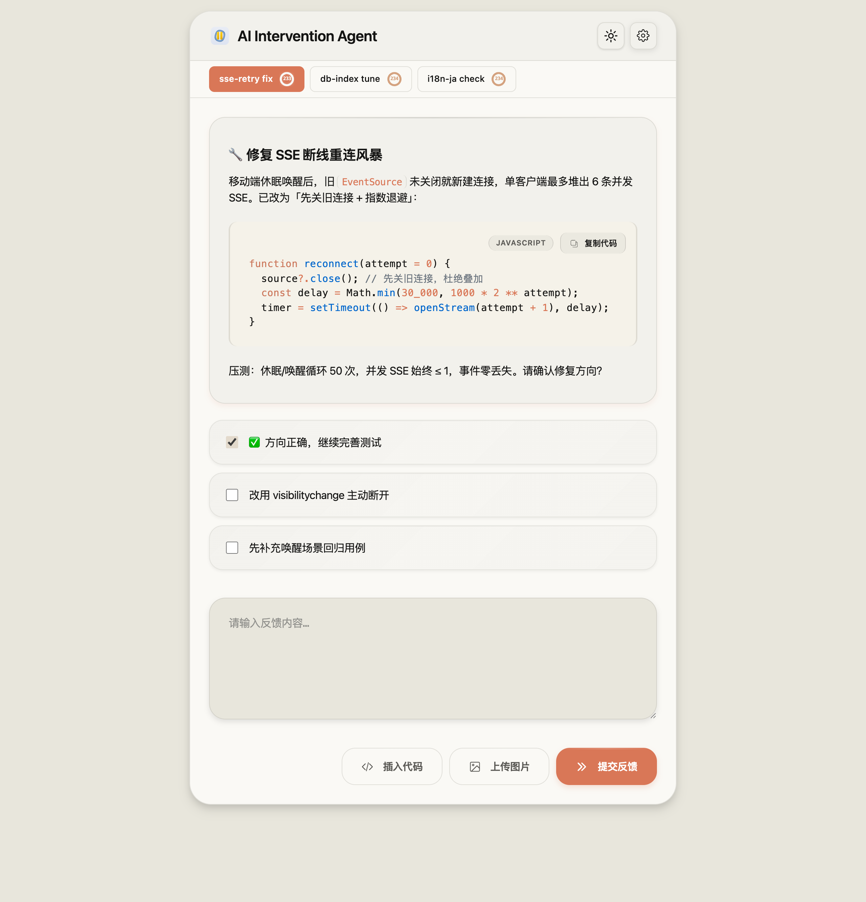
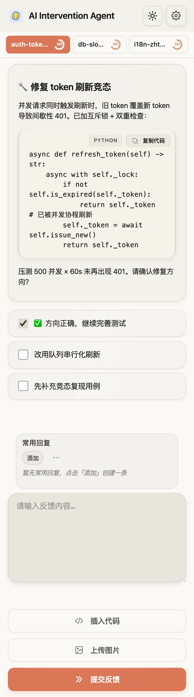
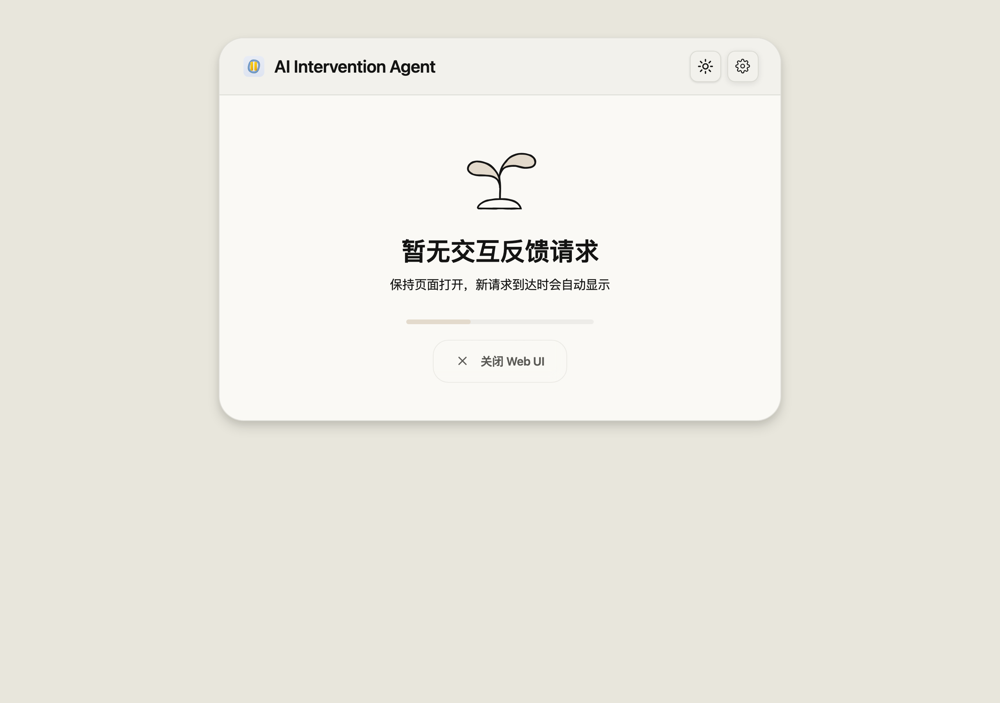
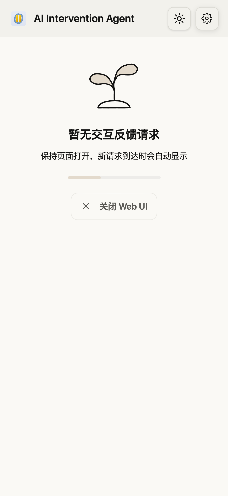
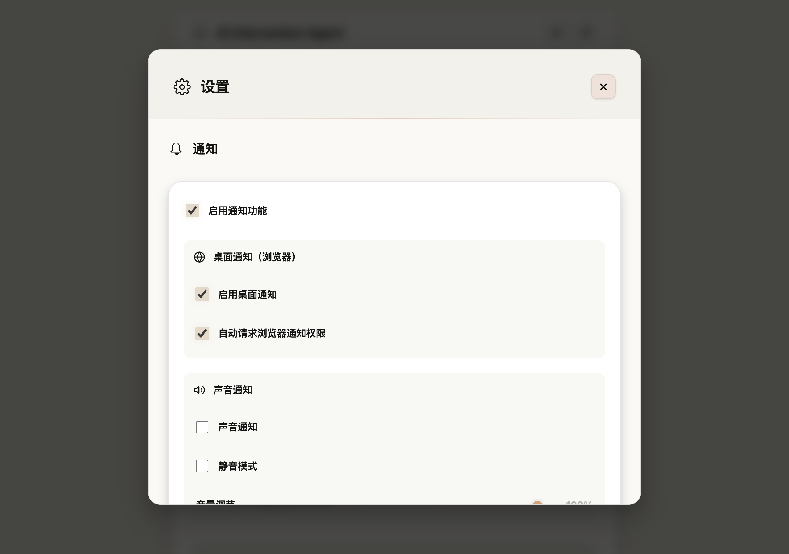
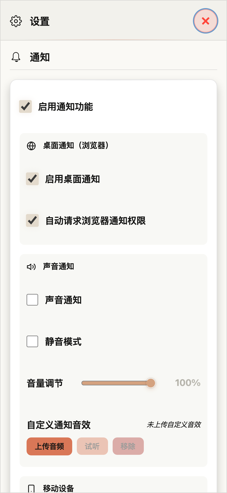

<div align="center">
  <a href="https://github.com/xiadengma/ai-intervention-agent">
    
  </a>

  <h2>AI Intervention Agent</h2>

  <p><strong>Real-time user intervention for MCP agents — pause, course-correct, resume.</strong></p>

  <p>
    <a href="https://pypi.org/project/ai-intervention-agent/">
      
    </a>
    <a href="https://www.python.org/downloads/">
      
    </a>
    <a href="https://modelcontextprotocol.io">
      
    </a>
    <a href="https://github.com/xiadengma/ai-intervention-agent/actions/workflows/test.yml">
      
    </a>
    <a href="https://github.com/xiadengma/ai-intervention-agent/actions/workflows/scorecard.yml">
      
    </a>
    <a href="https://github.com/xiadengma/ai-intervention-agent/blob/main/LICENSE">
      
    </a>
  </p>

  <p>
    English | <a href="./README.zh-CN.md">简体中文</a>
  </p>
</div>

---

Ever had your AI agent confidently walk off in the wrong direction mid-task? AI Intervention Agent gives you a Web UI to **pause** the agent at key moments, review what it's about to do, type a course-correction, attach screenshots, and **resume** — all through the MCP `interactive_feedback` tool, without ending the conversation.

Works with `Cursor`, `VS Code`, `Claude Code`, `Augment`, `Windsurf`, `Trae`, and more.

## Quick start

Point your AI tool at the MCP server via `uvx` (installs and runs the latest version automatically):

```json
{
  "mcpServers": {
    "ai-intervention-agent": {
      "command": "uvx",
      "args": ["ai-intervention-agent"],
      "timeout": 600,
      "autoApprove": ["interactive_feedback"]
    }
  }
}
```

[](https://cursor.com/en/install-mcp?name=ai-intervention-agent&config=eyJjb21tYW5kIjoidXZ4IiwiYXJncyI6WyJhaS1pbnRlcnZlbnRpb24tYWdlbnQiXSwidGltZW91dCI6NjAwLCJhdXRvQXBwcm92ZSI6WyJpbnRlcmFjdGl2ZV9mZWVkYmFjayJdfQ%3D%3D)
[](https://vscode.dev/redirect?url=vscode%3Amcp%2Finstall%3F%257B%2522name%2522%253A%2522ai-intervention-agent%2522%252C%2522command%2522%253A%2522uvx%2522%252C%2522args%2522%253A%255B%2522ai-intervention-agent%2522%255D%252C%2522timeout%2522%253A600%252C%2522autoApprove%2522%253A%255B%2522interactive_feedback%2522%255D%257D)

Then add the prompt snippet below to your agent rules / system prompt, so the agent asks you through `interactive_feedback` instead of finishing tasks silently.

<details>
<summary>Prompt snippet (copy/paste)</summary>

```text
- Only ask me through the MCP `ai-intervention-agent` tool; do not ask directly in chat or ask for end-of-task confirmation in chat.
- If a tool call fails, keep asking again through `ai-intervention-agent` instead of making assumptions, until the tool call succeeds.

ai-intervention-agent usage details:

- If requirements are unclear, use `ai-intervention-agent` to ask for clarification with predefined options.
- If there are multiple approaches, use `ai-intervention-agent` to ask instead of deciding unilaterally.
- If a plan/strategy needs to change, use `ai-intervention-agent` to ask instead of deciding unilaterally.
- Before finishing a request, always ask for feedback via `ai-intervention-agent`.
- Do not end the conversation/request unless the user explicitly allows it via `ai-intervention-agent`.
```

</details>

<details>
<summary>Alternative: install with pip</summary>

Install the package (remember to `pip install --upgrade ai-intervention-agent` periodically):

```bash
pip install ai-intervention-agent
```

Then configure your AI tool to launch the installed entry point:

```json
{
  "mcpServers": {
    "ai-intervention-agent": {
      "command": "ai-intervention-agent",
      "args": [],
      "timeout": 600,
      "autoApprove": ["interactive_feedback"]
    }
  }
}
```

</details>

<details>
<summary>Alternative: let your AI set it up for you</summary>

If your IDE/CLI has an AI agent (Cursor, Claude Code, VS Code, Windsurf, Trae, Augment, ...), paste this prompt in chat and let it write the config:

```text
Please configure my IDE / AI tool to use the `ai-intervention-agent` MCP server:

1. Locate the correct MCP config file for my current IDE
   (e.g. `.cursor/mcp.json` or `~/.cursor/mcp.json` for Cursor,
    `~/.claude.json` for Claude Code,
    `.vscode/mcp.json` for VS Code).
2. Add this entry under `mcpServers`:
   - command: `uvx`
   - args: `["ai-intervention-agent"]`
   - timeout: 600
   - autoApprove: `["interactive_feedback"]`
3. Append the project's recommended prompt rules
   (the "Prompt snippet (copy/paste)" block in this README)
   to my agent rules / system prompt, so the agent always asks me
   through `interactive_feedback` instead of ending tasks silently.
4. Verify by listing MCP servers and confirming `ai-intervention-agent` is loaded.
```

</details>

> [!NOTE]
> `interactive_feedback` is a **long-running tool**; some clients enforce a hard request timeout. The Web UI ships a countdown + auto re-submit (`feedback.frontend_countdown`, default `240`s, range `0` or `[10, 3600]`) to keep sessions alive — the default stays under the common 300s hard timeout.

## Screenshots

<p align="center">
  <picture>
    <source media="(prefers-color-scheme: dark)" srcset=".github/assets/desktop_dark_content.png">
    
  </picture>
  <picture>
    <source media="(prefers-color-scheme: dark)" srcset=".github/assets/mobile_dark_content.png">
    
  </picture>
</p>

<p align="center"><sub>Feedback page · auto switches between dark/light · multi-task tabs with independent countdowns</sub></p>

<details>
<summary>More screenshots (empty state + settings)</summary>

<p align="center">
  <picture>
    <source media="(prefers-color-scheme: dark)" srcset=".github/assets/desktop_dark_no_content.png">
    
  </picture>
  <picture>
    <source media="(prefers-color-scheme: dark)" srcset=".github/assets/mobile_dark_no_content.png">
    
  </picture>
</p>

<p align="center"><sub>Empty state · waiting for the next interactive request</sub></p>

<p align="center">
  <picture>
    <source media="(prefers-color-scheme: dark)" srcset=".github/assets/desktop_dark_settings.png">
    
  </picture>
  <picture>
    <source media="(prefers-color-scheme: dark)" srcset=".github/assets/mobile_dark_settings.png">
    
  </picture>
</p>

<p align="center"><sub>Settings · notifications · Bark · sound · feedback countdown · auto switches between dark/light</sub></p>

</details>

## Key features

- **Real-time intervention** — the agent pauses and waits for your input via `interactive_feedback`
- **Web UI** — Markdown, code highlighting, and math rendering out of the box
- **Multi-task tabs** — concurrent requests with independent countdowns, per-task draft autosave, and auto re-submit that keeps long sessions alive (your typed text and checked options are submitted at zero, never an empty prompt)
- **Typing-hold** — the countdown auto-extends while you type and never fires mid-input (web page and VS Code extension alike)
- **Agent-loop ergonomics** — per-task `header_label` context chips, `question_type='yesno'` one-click decisions, and `feedback_placeholder` hints
- **Notifications** — web / sound / system / Bark (iOS push), plus custom notification sound upload
- **SSH / LAN friendly** — works behind port forwarding; mDNS publishes a `<host>.local` URL when supported
- **i18n** — Web UI + VS Code extension shipped in `en` / `zh-CN` / `zh-TW`
- **PWA, offline-aware, WCAG 2.1 AA accessible** — installable from the browser, with contrast / focus / reduced-motion audited and locked by invariant tests
- **Stable install** — built on Flask 3.x with conservative dependency pins; immune to the [Starlette 1.0 breaking change](https://github.com/Minidoracat/mcp-feedback-enhanced/issues/213) that broke several MCP feedback servers in early 2026

## Architecture overview

AIIA runs as a single Python process bridging three surfaces: an MCP
stdio server exposing `interactive_feedback`, a Flask web server with
an SSE event bus, and a persistent task queue feeding the notification
stack. The component diagram, the interaction and failure-recovery
sequence diagrams, the agent-side MCP parameter table, and the runtime
invariant catalogue live in [`docs/architecture.md`](docs/architecture.md).

## VS Code extension (optional)

<p>
  <a href="https://open-vsx.org/extension/xiadengma/ai-intervention-agent">
    
  </a>
  <a href="https://open-vsx.org/extension/xiadengma/ai-intervention-agent">
    
  </a>
  <a href="https://open-vsx.org/extension/xiadengma/ai-intervention-agent">
    
  </a>
</p>

Embeds the interaction panel into VS Code's sidebar so you never switch to a browser.

- **Install**: [Open VSX](https://open-vsx.org/extension/xiadengma/ai-intervention-agent), [VS Code Marketplace](https://marketplace.visualstudio.com/items?itemName=xiadengma.ai-intervention-agent), or download the VSIX from [GitHub Releases](https://github.com/xiadengma/ai-intervention-agent/releases/latest)
- **Key setting**: `ai-intervention-agent.serverUrl` — must match your Web UI URL (e.g. `http://localhost:8080`; change the port via `web_ui.port` in [`config.toml.default`](config.toml.default))
- **More**: `ai-intervention-agent.logLevel`, macOS native notifications (on by default, toggle in the sidebar's Notification Settings panel) — full settings list and the AppleScript executor security model in [`packages/vscode/README.md`](packages/vscode/README.md)

## Configuration

On first run, `config.toml` is created from [`config.toml.default`](config.toml.default) in your OS user config directory — the full TOML reference is in [`docs/configuration.md`](docs/configuration.md):

| OS      | User config directory                                  |
| ------- | ------------------------------------------------------ |
| Linux   | `~/.config/ai-intervention-agent/`                     |
| macOS   | `~/Library/Application Support/ai-intervention-agent/` |
| Windows | `%APPDATA%/ai-intervention-agent/`                     |

For `uvx`, Docker, systemd, or SSH-remote runtimes where editing the file is awkward, the most-used `web_ui` settings can be overridden by env var at startup (invalid values log a `WARNING` and fall back safely; full surface in [`docs/configuration.md#environment-variable-overrides`](docs/configuration.md#environment-variable-overrides)):

```bash
export AI_INTERVENTION_AGENT_WEB_UI_HOST=0.0.0.0      # default 127.0.0.1
export AI_INTERVENTION_AGENT_WEB_UI_PORT=8181         # default 8080, range [1, 65535]
export AI_INTERVENTION_AGENT_WEB_UI_LANGUAGE=en       # auto / en / zh-CN / zh-TW
uvx ai-intervention-agent
```

CLI inspection: `--version`, `--help`, and `--print-config` (dumps the effective merged config as `jq`-friendly JSON, with secret-like fields redacted — answers "is my port from env or from `config.toml`?" in one pipeline).

On iPhone, the smoothest setup wraps the Web UI in a Shortcuts automation and points Bark notification taps at it — step-by-step guide in [`docs/configuration.md#recommended-iphone-setup-shortcuts--bark`](docs/configuration.md#recommended-iphone-setup-shortcuts--bark).

## Documentation

- **Docs index** (by audience): [`docs/README.md`](docs/README.md) · [`docs/README.zh-CN.md`](docs/README.zh-CN.md)
- **Architecture** (diagrams + agent workflow): [`docs/architecture.md`](docs/architecture.md)
- **MCP tool reference**: [`docs/mcp_tools.md`](docs/mcp_tools.md) · [`docs/mcp_tools.zh-CN.md`](docs/mcp_tools.zh-CN.md)
- **API docs**: [`docs/api/index.md`](docs/api/index.md) · [`docs/api.zh-CN/index.md`](docs/api.zh-CN/index.md)
- **Troubleshooting / FAQ**: [`docs/troubleshooting.md`](docs/troubleshooting.md) · [`docs/troubleshooting.zh-CN.md`](docs/troubleshooting.zh-CN.md)
- **Release notes**: [`CHANGELOG.md`](CHANGELOG.md) · VS Code marketplace listing: [`packages/vscode/CHANGELOG.md`](packages/vscode/CHANGELOG.md)
- **Contributing**: [`CONTRIBUTING.md`](.github/CONTRIBUTING.md) · [`CODE_OF_CONDUCT.md`](.github/CODE_OF_CONDUCT.md) · scripts index: [`scripts/README.md`](scripts/README.md) · i18n guide: [`docs/i18n.md`](docs/i18n.md)
- **Release recovery runbook**: [`docs/release-recovery.md`](docs/release-recovery.md) · [`docs/release-recovery.zh-CN.md`](docs/release-recovery.zh-CN.md)
- **DeepWiki Q&A** — AI-augmented Q&A over the repo: <a href="https://deepwiki.com/xiadengma/ai-intervention-agent"></a>

## Related projects

| Project | Stars (approx.) | Focus |
| --- | --- | --- |
| [mcp-feedback-enhanced](https://github.com/Minidoracat/mcp-feedback-enhanced) (Minidoracat) | ~3.8k | Largest sibling; Web UI + Tauri desktop app, auto-command execution, SSH Remote / WSL detection. |
| [cunzhi](https://github.com/imhuso/cunzhi) (imhuso) | ~1.4k | Chinese-language project focused on preventing premature task completion. |
| [Relay](https://glama.ai/mcp/servers/andeya/ide-relay-mcp) (andeya) | new | Multi-IDE relay, multi-tab session merging, native desktop window, Cursor usage monitoring. |
| [interactive-feedback-mcp (Node.js)](https://github.com/wellcomemayhem-spec/interactive-feedback-mcp-nodejs) | new | Node.js port with WebSocket UI and Speech-to-Text via OpenAI Whisper. |
| [interactive-feedback-mcp](https://github.com/junanchn/interactive-feedback-mcp) (junanchn) | ~50 | Win32-native always-on-top window, auto-reply rules. |
| [interactive-feedback-mcp](https://github.com/poliva/interactive-feedback-mcp) (poliva) | ~310 | Direct ancestor fork (see Acknowledgements); minimal Python MCP, single feedback dialog. |
| [interactive-feedback-mcp](https://github.com/Pursue-LLL/interactive-feedback-mcp) (Pursue-LLL) | ~30 | Independent smaller-scale fork emphasising minimal dependencies. |

**Where AIIA sits on the spectrum**: AIIA targets the operationally deep end — Web UI + VS Code extension sharing one backend, production-grade observability (`/metrics` Prometheus endpoint + a [reference Grafana dashboard](docs/observability/README.md)), bilingual i18n + docs, strict invariant test discipline (8,200+ tests + 1,050+ subtests across 40 audit cycles), and a 5-job release pipeline. Want the smallest drop-in? poliva's fork. A desktop app? mcp-feedback-enhanced. Voice / multi-tab UI? Relay or the Node.js fork. Full-stack operational integration? AIIA.

**Feature gap callouts** (contributions welcome): Speech-to-Text input, always-on-top native window, Cursor usage monitoring, multi-tab session merging UI.

> Star counts are approximate snapshots (last reviewed 2026-06); check each upstream for current numbers. Submit a PR if you'd like another related project listed.

## Acknowledgements

This project's heritage traces back to **Fábio Ferreira** (2024) and **Pau Oliva** (2025), whose original [`noopstudios/interactive-feedback-mcp`](https://github.com/noopstudios/interactive-feedback-mcp) and [`poliva/interactive-feedback-mcp`](https://github.com/poliva/interactive-feedback-mcp) seeded the MCP `interactive_feedback` tool surface. Their copyright notices are preserved in [`LICENSE`](LICENSE) per the MIT license terms. The v1.5.x line is a substantial rewrite — Web UI, VS Code extension, i18n, notification stack, CI/CD pipeline — owned and maintained by [@xiadengma](https://github.com/xiadengma) (PyPI / Open VSX / VS Code Marketplace publisher).

## License

MIT License
