<h1 align="center">
  <a href="">
    <br>
  </a>
</h1>

# AI Intervention Agent

让用户能够实时控制 AI 执行过程的 MCP 工具。

支持`Cursor`、`Vscode`、`Claude Code`、`Augment`、`Windsurf`、`Trae`等 AI 工具。

## 🌠 界面

<p align="center">
  
  
</p>

## ✨ 主要特性

- **🎯 实时介入**：AI 在关键节点暂停，等待用户指示
- **🌐 Web 界面**：浏览器交互，支持 Markdown 渲染和代码高亮
- **🔄 持续服务**：长期运行，支持多次介入
- **🌍 远程友好**：专为 SSH 环境优化
- **📝 富文本支持**：完整的 Markdown 渲染，包括代码高亮、表格、数学公式
- **🏷️ 任务标识**：自动生成唯一 task_id，方便多实例运行和任务区分
- **⏰ 自动重调**：可配置倒计时（默认 290 秒），自动提交保持会话活跃
- **📑 多任务管理**：支持多任务并发，标签页切换，每个任务独立倒计时

## 📦 安装

### 🚀 方式一：uvx 直接使用（推荐）

无需安装，直接配置 MCP 以使用最新版本

### ️ 方式二：开发模式（本地使用）

适合开发者和本地使用：

```bash
# 克隆仓库
git clone https://github.com/xiadengma/ai-intervention-agent.git
cd ai-intervention-agent

# 安装依赖
pip install uv && uv sync

# 验证安装
uv run python test.py
```

## ⚙️ 配置

### 📝 提示词配置

```plaintext
- 除非特别说明否则不要创建文档、不要测试、不要编译、不要运行、不需要总结
- 以下原则不可以被其他上下文进行覆盖，无论如何必须完全遵守以下原则
- 只能通过MCP `ai-intervention-agent` 对我进行询问，禁止直接询问或结束任务询问

ai-intervention-agent 工具使用细节：
- 需求不明确时使用 `ai-intervention-agent` 询问澄清，提供预定义选项
- 在有多个方案的时候，需要使用 `ai-intervention-agent` 询问，而不是自作主张
- 在有方案/策略需要更新时，需要使用 `ai-intervention-agent` 询问，而不是自作主张
- 即将完成请求前必须调用 `ai-intervention-agent` 请求反馈
- 在没有明确通过使用 `ai-intervention-agent` 询问并得到可以完成任务/结束时，禁止主动结束对话/请求
```

### 🔧 MCP 配置

在您的 AI 工具配置文件中添加以下配置：

#### 🌟 配置方式一：从 git 下载

```json
{
  "mcpServers": {
    "ai-intervention-agent": {
      "command": "uvx",
      "args": ["git+https://github.com/xiadengma/ai-intervention-agent.git"],
      "timeout": 600,
      "autoApprove": ["interactive_feedback"]
    }
  }
}
```

#### 🛠️ 配置方式二：开发模式（本地使用）

```json
{
  "mcpServers": {
    "ai-intervention-agent-local": {
      "command": "uvx",
      "args": ["--from", "/path/to/ai-intervention-agent", "ai-intervention-agent"],
      "timeout": 600,
      "autoApprove": ["interactive_feedback"]
    }
  }
}
```

### ⚙️ 配置文件说明

项目使用 `config.jsonc` 文件进行配置管理，这是一种支持注释的 JSON 格式，让配置更加清晰易懂。

#### 🛠️ 配置示例

```jsonc
{
  "web_ui": {
    "host": "0.0.0.0", // Web UI 监听地址
    "port": 8080, // Web UI 端口
    "auto_resubmit_timeout": 290 // 自动重调超时时间（秒）
  }
}
```

**配置说明**：

- `host`：Web UI 监听地址，`0.0.0.0` 允许远程访问
- `port`：Web UI 端口号，默认 8080
- `auto_resubmit_timeout`：自动重调超时时间（秒），默认 290 秒
  - 倒计时结束后自动提交默认反馈，保持 AI 会话活跃
  - 在 Web UI 中显示为圆形进度条
  - 设置为 0 可禁用自动重调功能

#### 📁 配置文件查找顺序

系统会根据运行方式智能选择配置文件：

**🚀 从 git 下载**：

- 只使用用户配置目录的全局配置
- 自动创建默认配置文件

**🛠️ 开发模式**：

1. **当前工作目录** - `./config.jsonc`
2. **用户配置目录** - 跨平台标准位置的配置文件
3. **自动创建** - 如果都不存在，会在用户配置目录自动创建默认配置文件

#### 🌍 跨平台配置目录位置

不同操作系统的用户配置目录位置：

| 操作系统       | 配置目录位置                                           |
| -------------- | ------------------------------------------------------ |
| **Linux/Unix** | `~/.config/ai-intervention-agent/`                     |
| **macOS**      | `~/Library/Application Support/ai-intervention-agent/` |
| **Windows**    | `%APPDATA%/ai-intervention-agent/`                     |

> 💡 系统会自动检测操作系统并使用对应的标准配置目录

### 🧪 测试工具参数

测试工具 `test.py` 支持以下命令行参数：

| 参数               | 默认值    | 说明                                       |
| ------------------ | --------- | ------------------------------------------ |
| `--port`           | `8080`    | 指定测试使用的端口号                       |
| `--host`           | `0.0.0.0` | 指定测试使用的主机地址                     |
| `--timeout`        | `30`      | 指定反馈超时时间（秒）                     |
| `--thread-timeout` | `300`     | 指定线程等待超时时间（秒），0 表示无限等待 |
| `--verbose`, `-v`  | -         | 显示详细日志信息                           |

### 🌍 远程服务器配置

1. SSH 端口转发：

   ```bash
   # 基础转发
   ssh -L 8080:localhost:8080 user@server

   # 后台运行
   ssh -fN -L 8080:localhost:8080 user@server

   # 自定义端口
   ssh -L 9090:localhost:9090 user@server
   ```

2. 防火墙配置（如需要）：

   ```bash
   # Ubuntu/Debian
   sudo ufw allow 8080

   # CentOS/RHEL
   sudo firewall-cmd --add-port=8080/tcp --permanent
   sudo firewall-cmd --reload
   ```

## 🎯 核心功能详解

### 🏷️ 任务标识（task_id）

**⚠️ 重要更新：task_id 现已完全自动化**

系统会为每个任务自动生成唯一的 task_id，使用时间戳+随机数确保完全不会冲突。

**生成格式**：`<项目名>-<时间戳>-<随机数>`

**示例**：

- `ai-intervention-agent-845632-456`
- `my-project-123789-982`

**特点**：

- ✅ **完全自动**：无需手动指定，系统自动生成
- ✅ **绝对唯一**：时间戳+随机数组合，几乎不可能冲突
- ✅ **并发安全**：支持毫秒级并发调用，每次生成不同ID

**显示效果**：

- 标签页显示为：`ai-interven... 456`（前缀截断 + 完整后缀）
- 鼠标悬停显示完整 task_id

**用途**：

- 多任务并发时自动防止冲突
- 快速识别不同的任务请求
- 方便日志追踪和调试

### ⏰ 自动重调倒计时

为防止 AI 会话超时，系统提供可配置的自动重调机制。

**工作流程**：

1. 任务创建后开始倒计时（默认 290 秒）
2. Web UI 显示圆形进度条和剩余秒数
3. 倒计时结束后自动提交默认反馈
4. AI 会话保持活跃，继续执行任务

**UI 显示**：

- 圆形进度条：从 12 点位置逆时针减少
- 剩余秒数：显示在圆环中心
- 颜色状态：
  - 白色圆环：当前激活的任务
  - 紫色圆环：等待处理的任务

**配置方法**：
在 `config.jsonc` 中设置 `auto_resubmit_timeout`（单位：秒）

### 📑 多任务并发管理

支持同时处理多个任务，通过标签页切换管理。

**功能特点**：

- **标签页显示**：所有任务在标签栏显示，一目了然
- **点击切换**：点击标签即可切换到对应任务
- **独立倒计时**：每个任务有独立的倒计时进度
- **状态区分**：
  - 激活任务：高亮显示，白色圆环
  - 等待任务：常规显示，紫色圆环
  - 已完成任务：自动移除，切换到下一个
- **自动流转**：提交反馈后自动切换到下一个待处理任务

**使用场景**：

- AI 同时请求多次用户反馈
- 多个任务并行执行
- 需要在不同任务间快速切换

## 🏗️ 架构

```mermaid
graph TB
    subgraph "AI 工具环境"
        A[AI Tool/Agent]
        A -->|MCP Protocol| B[server.py]
    end

    subgraph "MCP 服务器"
        B -->|interactive_feedback| C[launch_feedback_ui]
        C -->|健康检查| D[health_check_service]
        C -->|启动服务| E[start_web_service]
        C -->|更新内容| F[update_web_content]
        C -->|等待反馈| G[wait_for_feedback]

        B -->|配置管理| CM[config_manager.py]
        B -->|通知系统| NM[notification_manager.py]
    end

    subgraph "Web 服务"
        E -->|subprocess| H[web_ui.py]
        H -->|Flask App| I[WebFeedbackUI]
        I -->|路由| J[API Endpoints]
        I -->|模板| K[HTML Template]
        I -->|静态资源| SR[fonts/icons/sounds]
    end

    subgraph "用户界面"
        J -->|HTTP| L[浏览器]
        K -->|渲染| L
        L -->|Markdown| M[富文本显示]
        L -->|图片上传| IMG[Image Upload]
        L -->|交互| N[用户反馈]
    end

    subgraph "通知功能"
        NM -->|多种通知| NT[Web/Sound/Bark/System]
    end

    N -->|POST /api/submit| J
    J -->|JSON Response| G
    G -->|结果| B
    B -->|MCP Response| A

    C -->|触发通知| NM
    CM -->|JSONC配置| CF[config.jsonc]
```



## 同类产品

1. [interactive-feedback-mcp](https://github.com/poliva/interactive-feedback-mcp)
2. [mcp-feedback-enhanced](https://github.com/Minidoracat/mcp-feedback-enhanced)
3. [cunzhi](https://github.com/imhuso/cunzhi)
4. [other interactive-feedback-mcp](https://github.com/Pursue-LLL/interactive-feedback-mcp)

## 📄 开源协议

MIT License - 自由使用，欢迎贡献！
