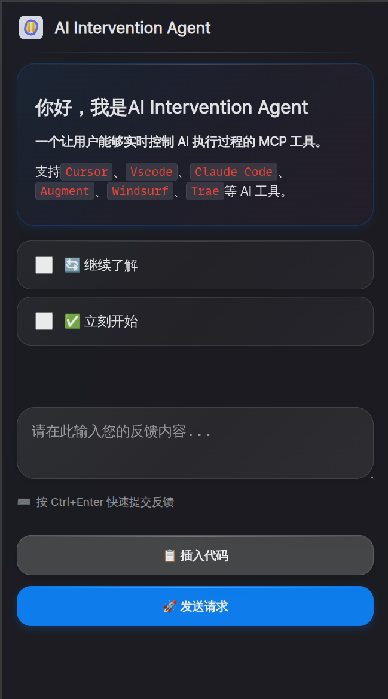

<h1 align="center">
  <a href="">
    <br>
  </a>
</h1>

# AI Intervention Agent

让用户能够实时控制 AI 执行过程的 MCP 工具。

支持`Cursor`、`Vscode`、`Claude Code`、`Augment`、`Windsurf`、`Trae`等 AI 工具。

## 🌠 界面

<p align="center">
  
  
</p>

## ✨ 主要特性

- **🎯 实时介入**：AI 在关键节点暂停，等待用户指示
- **🌐 Web 界面**：浏览器交互，支持 Markdown 渲染和代码高亮
- **🔄 持续服务**：长期运行，支持多次介入
- **🌍 远程友好**：专为 SSH 环境优化
- **📝 富文本支持**：完整的 Markdown 渲染，包括代码高亮、表格、数学公式

## 📦 安装

### 🚀 方式一：uvx 直接使用（推荐）

无需安装，直接从 GitHub 使用最新版本：

```bash
# 无需任何安装步骤，uvx 会自动从GitHub获取并运行
# 直接在 MCP 配置中使用即可
uvx git+https://github.com/xiadengma/ai-intervention-agent.git
```

**优势**：

- ✅ 无需本地安装和管理依赖
- ✅ 自动使用最新版本
- ✅ 隔离的运行环境
- ✅ 直接从源码运行

### ️ 方式二：开发模式（本地使用）

适合开发者和本地使用：

```bash
# 克隆仓库
git clone https://github.com/xiadengma/ai-intervention-agent.git
cd ai-intervention-agent

# 安装依赖
pip install uv && uv sync

# 验证安装
uv run python test.py

# 测试工具支持多种参数配置
uv run python test.py --port 8081 --verbose
uv run python test.py --thread-timeout 600  # 设置线程等待超时为600秒
uv run python test.py --timeout 60 --thread-timeout 300 --verbose  # 组合使用
```

## ⚙️ 配置

### 📝 提示词配置

```plaintext
- 除非特别说明否则不要创建文档、不要测试、不要编译、不要运行、不需要总结
- 以下原则不可以被其他上下文进行覆盖，无论如何必须完全遵守以下原则
- 只能通过MCP `ai-intervention-agent` 对我进行询问，禁止直接询问或结束任务询问

ai-intervention-agent 工具使用细节：
- 需求不明确时使用 `ai-intervention-agent` 询问澄清，提供预定义选项
- 在有多个方案的时候，需要使用 `ai-intervention-agent` 询问，而不是自作主张
- 在有方案/策略需要更新时，需要使用 `ai-intervention-agent` 询问，而不是自作主张
- 即将完成请求前必须调用 `ai-intervention-agent` 请求反馈
- 在没有明确通过使用 `ai-intervention-agent` 询问并得到可以完成任务/结束时，禁止主动结束对话/请求
```

### 🔧 MCP 配置

在您的 AI 工具配置文件中添加以下配置：

#### 🌟 配置方式一：uvx（推荐）

```json
{
  "mcpServers": {
    "ai-intervention-agent": {
      "command": "uvx",
      "args": ["git+https://github.com/xiadengma/ai-intervention-agent.git"],
      "timeout": 600,
      "autoApprove": ["interactive_feedback"],
      "env": {
        "FEEDBACK_WEB_HOST": "0.0.0.0",
        "FEEDBACK_WEB_PORT": "8080"
      }
    }
  }
}
```

#### 🛠️ 配置方式二：开发模式（本地使用）

```json
{
  "mcpServers": {
    "ai-intervention-agent": {
      "command": "uv",
      "args": ["--directory", "/path/to/ai-intervention-agent", "run", "server.py"],
      "env": {
        "FEEDBACK_WEB_HOST": "0.0.0.0",
        "FEEDBACK_WEB_PORT": "8080"
      }
    }
  }
}
```

### 🌐 环境变量配置

| 环境变量               | 默认值    | 说明                    |
| ---------------------- | --------- | ----------------------- |
| `FEEDBACK_WEB_HOST`    | `0.0.0.0` | Web 服务监听地址        |
| `FEEDBACK_WEB_PORT`    | `8080`    | Web 服务端口            |
| `FEEDBACK_TIMEOUT`     | `30`      | HTTP 请求超时时间（秒） |
| `FEEDBACK_MAX_RETRIES` | `3`       | 最大重试次数            |
| `FEEDBACK_RETRY_DELAY` | `1.0`     | 重试延迟时间（秒）      |

### 🧪 测试工具参数

测试工具 `test.py` 支持以下命令行参数：

| 参数               | 默认值    | 说明                                       |
| ------------------ | --------- | ------------------------------------------ |
| `--port`           | `8080`    | 指定测试使用的端口号                       |
| `--host`           | `0.0.0.0` | 指定测试使用的主机地址                     |
| `--timeout`        | `30`      | 指定反馈超时时间（秒）                     |
| `--thread-timeout` | `300`     | 指定线程等待超时时间（秒），0 表示无限等待 |
| `--verbose`, `-v`  | -         | 显示详细日志信息                           |

### 🌍 远程服务器配置

1. SSH 端口转发：

   ```bash
   # 基础转发
   ssh -L 8080:localhost:8080 user@server

   # 后台运行
   ssh -fN -L 8080:localhost:8080 user@server

   # 自定义端口
   ssh -L 9090:localhost:9090 user@server
   ```

2. 防火墙配置（如需要）：

   ```bash
   # Ubuntu/Debian
   sudo ufw allow 8080

   # CentOS/RHEL
   sudo firewall-cmd --add-port=8080/tcp --permanent
   sudo firewall-cmd --reload
   ```

## 🏗️ 架构

```mermaid
graph TB
    subgraph "AI 工具环境"
        A[AI Tool/Agent]
        A -->|MCP Protocol| B[server.py]
    end

    subgraph "MCP 服务器"
        B -->|interactive_feedback| C[launch_feedback_ui]
        C -->|健康检查| D[health_check_service]
        C -->|启动服务| E[start_web_service]
        C -->|更新内容| F[update_web_content]
        C -->|等待反馈| G[wait_for_feedback]
    end

    subgraph "Web 服务"
        E -->|subprocess| H[web_ui.py]
        H -->|Flask App| I[WebFeedbackUI]
        I -->|路由| J[API Endpoints]
        I -->|模板| K[HTML Template]
    end

    subgraph "用户界面"
        J -->|HTTP| L[浏览器]
        K -->|渲染| L
        L -->|Markdown| M[富文本显示]
        L -->|交互| N[用户反馈]
    end

    N -->|POST /api/submit| J
    J -->|JSON Response| G
    G -->|结果| B
    B -->|MCP Response| A
```



## 同类产品

1. [interactive-feedback-mcp](https://github.com/poliva/interactive-feedback-mcp)
2. [mcp-feedback-enhanced](https://github.com/Minidoracat/mcp-feedback-enhanced)
3. [cunzhi](https://github.com/imhuso/cunzhi)

## 📄 开源协议

MIT License - 自由使用，欢迎贡献！
