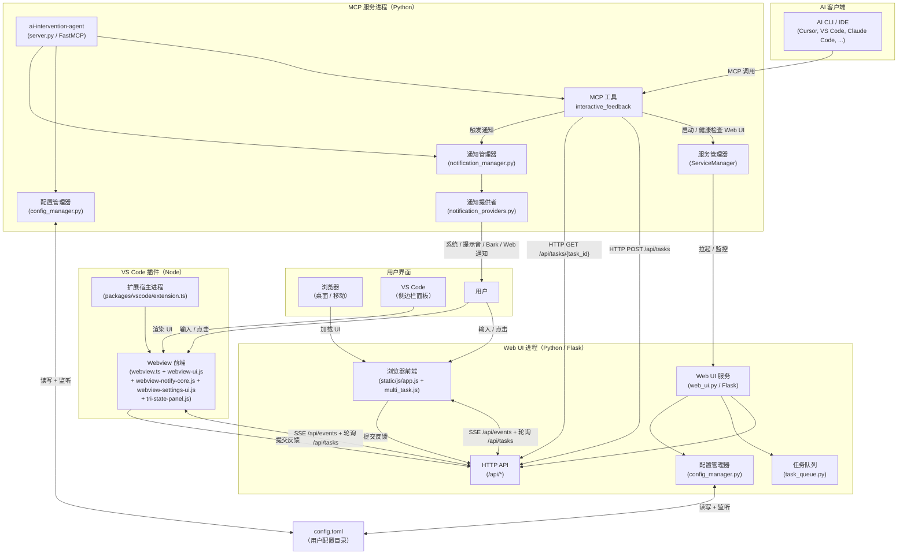

# AI Intervention Agent API 文档

中文 API 参考（含完整 docstring 叙述）。

- English version: [`docs/api/index.md`](../api/index.md)

## 工作原理

1. AI 客户端调用 MCP 工具 `interactive_feedback`。
2. MCP 服务进程确认 Web UI 子进程在线后，通过 HTTP（`POST /api/tasks`）创建一个任务。
3. 浏览器或 VS Code Webview 通过 **双通道** 渲染任务：SSE
   （`GET /api/events`，支持 `Last-Event-ID` 续传）做实时更新，HTTP 轮询做兜底。
4. 用户在 UI 中提交反馈后，Web UI 在任务队列里把任务标记为完成。
5. MCP 服务通过 SSE + 低频 HTTP 轮询（`GET /api/tasks/{task_id}`）等待，
   再把反馈（文本 + 图片）回传给 AI 客户端。
6. 同时根据用户配置触发通知（Bark / 系统通知 / 提示音 / Web 提示）。
   loopback 形态的 Bark URL 会被自动过滤，并由设置面板推荐对应的局域网 IP。

## 架构

> 架构图只展示了顶层进程与可见度最高的模块。`state_machine.py`
> （每任务生命周期）、`web_ui_mdns.py`（局域网 mDNS 服务发布）、
> `web_ui_security.py`（CSRF / 来源校验 / 鉴权）、`task_queue_singleton.py`
> （单进程任务队列访问器）、`server_feedback.py`（`interactive_feedback`
> 工具实现）、`enhanced_logging.py`、`protocol.py` 等内部模块都在同
> 两个进程内，每个模块的详细 API 都在下方的模块列表里。

## 生产级中间件

工具调用被包裹在一条四级中间件链中：
`ErrorHandling` → `RateLimiting`（10 req/s，突发 20） → `Timing` → `Logging`。
结构化的 `task.created` / `task.notified` / `task.completed` 事件会通过
`ctx.info` 转发给 MCP 客户端，Cursor / Claude Desktop / ChatGPT Desktop
等聊天式客户端会在侧边栏直接看到进度条。

## Server 自检 resource

客户端可读 `aiia://server/info`（MIME `application/json`，tag
`diagnostics` / `self-info`）来获取服务运行快照：`name` / `version` /
`transport` / `runtime`（Python 版本 + 解释器路径 + 平台）/
`fastmcp.version` / `middleware` 链 / `error_stats` /
`web_ui`（host + port + 可达性） / `task_queue`（是否已初始化 + 大小 +
pending）。该 resource 无副作用，状态面板可以放心轮询。

## MCP 协议规范支持（2025-11-25 协议）

`interactive_feedback` 暴露了完整的 MCP 工具注解
（`title` / `readOnlyHint=false` / `destructiveHint=false` /
`idempotentHint=false` / `openWorldHint=true`），并通过 FastMCP 的 tag
体系（`human-in-the-loop` / `feedback` / `approval`）以及 server 身份元数据
（`name` / `version` / `instructions` / `website_url` / `icons`）让
ChatGPT Desktop / Claude Desktop / Cursor 等客户端原生渲染，避免在用户
工具栏里出现"会执行破坏性操作"的强警告。完整的 annotation 表见
[`docs/mcp_tools.zh-CN.md`](../mcp_tools.zh-CN.md)。

## 模块列表

- [config_manager](config_manager.md)
- [config_utils](config_utils.md)
- [exceptions](exceptions.md)
- [i18n](i18n.md)
- [mcp_tool_call_metrics](mcp_tool_call_metrics.md)
- [protocol](protocol.md)
- [remote_environment](remote_environment.md)
- [state_machine](state_machine.md)
- [server](server.md)
- [server_feedback](server_feedback.md)
- [server_config](server_config.md)
- [service_manager](service_manager.md)
- [shared_types](shared_types.md)
- [sse_event_schemas](sse_event_schemas.md)
- [notification_manager](notification_manager.md)
- [notification_models](notification_models.md)
- [notification_providers](notification_providers.md)
- [task_queue](task_queue.md)
- [task_queue_singleton](task_queue_singleton.md)
- [web_ui](web_ui.md)
- [web_ui_config_sync](web_ui_config_sync.md)
- [web_ui_mdns](web_ui_mdns.md)
- [web_ui_mdns_utils](web_ui_mdns_utils.md)
- [web_ui_security](web_ui_security.md)
- [web_ui_validators](web_ui_validators.md)
- [file_validator](file_validator.md)
- [enhanced_logging](enhanced_logging.md)

## 快速导航

### 核心模块

- **config_manager**: 配置管理
- **exceptions**: 统一异常定义与错误响应
- **notification_manager**: 通知管理
- **protocol**: 协议版本、Capabilities、服务器时钟 —— 前后端契约的单一事实来源
- **state_machine**: 连接 / 内容 / 交互状态机（与前端 `state.js` 常量一一对应）
- **server**: MCP 服务器入口 —— `interactive_feedback` 工具注册、多任务队列生命周期、通知集成与 `main()` 事件循环
- **server_feedback**: 从 `server.py` 抽出的 `interactive_feedback` 工具实现 —— 任务轮询、上下文管理、未装饰的工具函数本体（注册仍在 `server.mcp`）
- **server_config**: MCP 服务器配置与工具函数（数据类、常量、输入验证、响应解析）
- **service_manager**: Web 服务编排层 —— 进程生命周期管理、HTTP 客户端、Web UI 启动与健康检查
- **task_queue**: 任务队列
- **task_queue_singleton**: 轻量级 `TaskQueue` 单例访问器（与 `server.py` 解耦）—— 让 Web UI 子进程不再为了拿一个 task queue 而触发 `fastmcp` / `mcp` 整条依赖链加载（R20.8 启动延迟优化）
- **web_ui**: Flask Web UI 主类 —— 多任务面板、文件上传、通知、mDNS 发布、安全中间件与浏览器引导
- **web_ui_security**: 安全策略 Mixin —— IP 访问控制、CSP 安全头注入、网络安全配置加载（通过 MRO 注入 `WebFeedbackUI`）
- **web_ui_validators**: 网络安全配置 / 超时校验的纯函数（从 `web_ui.py` 抽出；测试 / CLI / 配置热更新均可安全复用）

### 工具模块

- **config_utils**: 配置工具函数
- **i18n**: 后端轻量 i18n（请求语言检测 + 本地化消息查表）
- **mcp_tool_call_metrics**: MCP 工具调用计数器中间件（R187 / T2）—— 为 `/api/system/metrics` 的 `aiia_mcp_tool_calls_total{tool,status}` Prometheus 指标提供数据源
- **shared_types**: 共享 TypedDict 类型定义
- **sse_event_schemas**: SSE 事件 schema 注册表（R198 / Cycle 7）—— 集中定义每种已知 SSE `event_type` 及其 payload 字段集；测试确保 `_sse_bus.emit("<literal>", ...)` 的每个调用点都有匹配的 schema 项
- **notification_models**: 通知数据模型
- **notification_providers**: 具体通知后端实现（Web Push / 系统声音 / Bark / 移动振动 / macOS 原生）
- **file_validator**: 文件验证
- **enhanced_logging**: 日志增强
- **remote_environment**: SSH / WSL 远程环境探测（R225）—— 纯函数探针；Web UI 启动横幅据此在 host 为回环且检测到远程会话时，给出可操作的端口转发提示
- **web_ui_config_sync**: 配置热更新回调 —— 把 `feedback.auto_resubmit_timeout` 与网络安全配置变更同步到运行中的任务 / Web UI 实例
- **web_ui_mdns**: mDNS / DNS-SD 生命周期 Mixin —— 服务发现、注册、注销
- **web_ui_mdns_utils**: mDNS 纯函数辅助 —— 主机名规范化、虚拟网卡过滤、IPv4 探测

---

_文档自动生成于 `docs/api.zh-CN/`_
