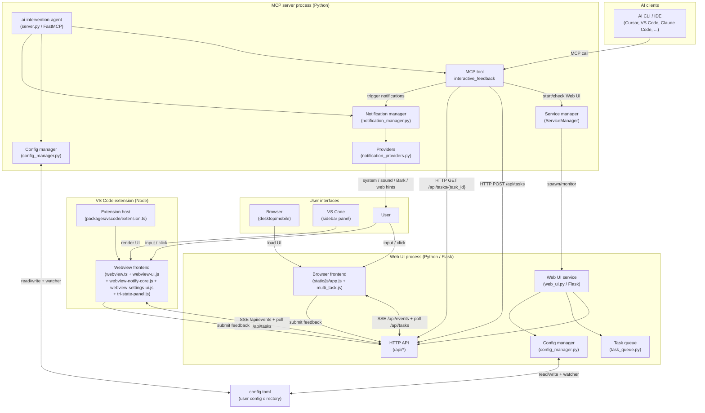

# AI Intervention Agent API Docs

English API reference (signatures-focused).

- Chinese version: [`docs/api.zh-CN/index.md`](../api.zh-CN/index.md)

## How it works

1. Your AI client calls the MCP tool `interactive_feedback`.
2. The MCP server ensures the Web UI process is running, then creates a task
   via HTTP (`POST /api/tasks`).
3. The browser (or VS Code Webview) renders the task using a **dual-channel**
   transport: SSE (`GET /api/events`, with `Last-Event-ID` resume) for
   real-time updates, and HTTP polling as a safety net when SSE drops.
4. When you submit feedback, the Web UI completes the task in the task queue.
5. The MCP server waits via SSE + a low-frequency HTTP poll
   (`GET /api/tasks/{task_id}`), then returns your feedback (text + images)
   back to the AI client.
6. Optionally, the MCP server triggers notifications (Bark / system / sound /
   web hints) based on your config. Bark URLs that resolve to loopback
   addresses are automatically suppressed and the Web UI surfaces a LAN-IP
   suggestion in the settings panel.

## Architecture

> The diagram intentionally shows top-level processes and the most visible
> modules. Internal helpers — e.g. `state_machine.py` (per-task lifecycle),
> `web_ui_mdns.py` (LAN service discovery via mDNS), `web_ui_security.py`
> (CSRF / origin / token gates), `task_queue_singleton.py` (single-process
> queue access), `server_feedback.py` (the `interactive_feedback` MCP tool
> body), `enhanced_logging.py`, `protocol.py`, etc. — live in the same two
> processes and are documented per-module below.

## Production-grade middleware

Tool invocations are wrapped by a four-stage middleware chain:
`ErrorHandling` → `RateLimiting` (10 req/s, burst 20) → `Timing` →
`Logging`. Structured `task.created` / `task.notified` / `task.completed`
events are forwarded to the MCP client via `ctx.info` so chat-style clients
(Cursor / Claude Desktop / ChatGPT Desktop) can render a live progress
entry in the sidebar.

## Server self-info resource

Clients can read `aiia://server/info` (MIME `application/json`, tags
`diagnostics` / `self-info`) for a JSON snapshot of the running server:
`name` / `version` / `transport` / `runtime` (Python version + executable +
platform) / `fastmcp.version` / `middleware` chain / `error_stats` /
`web_ui` (host + port + reachability) / `task_queue` (initialized + size +
pending). The resource is side-effect free — safe to poll from a status
panel.

## MCP-spec compliance (2025-11-25 protocol)

`interactive_feedback` exposes the full MCP tool annotations (`title`,
`readOnlyHint=false`, `destructiveHint=false`, `idempotentHint=false`,
`openWorldHint=true`) plus FastMCP tags
(`human-in-the-loop` / `feedback` / `approval`) and server identity metadata
(`name` / `version` / `instructions` / `website_url` / `icons`). Clients like
ChatGPT Desktop / Claude Desktop / Cursor render the server natively without
nagging "destructive operation" confirmations. See
[`docs/mcp_tools.md`](../mcp_tools.md) for the full annotation table.

`interactive_feedback` remains a statically registered core tool. Dynamic MCP
tool registration is documented only as a future optional/conditional extension
point, gated on proven client support for `notifications/tools/list_changed`.

## Modules

- [config_manager](config_manager.md)
- [config_utils](config_utils.md)
- [exceptions](exceptions.md)
- [i18n](i18n.md)
- [mcp_tool_call_metrics](mcp_tool_call_metrics.md)
- [protocol](protocol.md)
- [remote_environment](remote_environment.md)
- [state_machine](state_machine.md)
- [server](server.md)
- [server_feedback](server_feedback.md)
- [server_config](server_config.md)
- [service_manager](service_manager.md)
- [shared_types](shared_types.md)
- [sse_event_schemas](sse_event_schemas.md)
- [notification_manager](notification_manager.md)
- [notification_models](notification_models.md)
- [notification_providers](notification_providers.md)
- [task_queue](task_queue.md)
- [task_queue_singleton](task_queue_singleton.md)
- [web_ui](web_ui.md)
- [web_ui_config_sync](web_ui_config_sync.md)
- [web_ui_mdns](web_ui_mdns.md)
- [web_ui_mdns_utils](web_ui_mdns_utils.md)
- [web_ui_security](web_ui_security.md)
- [web_ui_validators](web_ui_validators.md)
- [file_validator](file_validator.md)
- [enhanced_logging](enhanced_logging.md)

## Quick navigation

### Core modules

- **config_manager**: Configuration management
- **exceptions**: Unified exception definitions and error responses
- **notification_manager**: Notification orchestration
- **protocol**: Protocol version, capabilities, and server clock — single source of truth for the front/back contract
- **state_machine**: Connection / content / interaction state machines (mirrors front-end constants in `state.js`)
- **server**: MCP server entry point — `interactive_feedback` tool registration, multi-task queue lifecycle, notification integration, and the `main()` event loop
- **server_feedback**: `interactive_feedback` MCP tool implementation extracted from `server.py` — task polling, context management, undecorated tool function (registration stays on `server.mcp`)
- **server_config**: MCP server configuration and utility helpers (dataclasses, constants, input validation, response parsing)
- **service_manager**: Web service orchestration — process lifecycle, HTTP client, Web UI bring-up + health checks
- **task_queue**: Task queue
- **task_queue_singleton**: Lightweight `TaskQueue` singleton accessor decoupled from `server.py` — keeps the Web UI subprocess from pulling in `fastmcp` / `mcp` purely to access the queue (R20.8 startup-latency optimisation)
- **web_ui**: Flask Web UI main class — multi-task panel, file uploads, notifications, mDNS publishing, security middleware, and browser bootstrapping
- **web_ui_security**: Security policy mixin — IP allow/deny lists, CSP headers, network-security config loading (mixed into `WebFeedbackUI` via MRO)
- **web_ui_validators**: Pure validation/normalisation helpers for network-security configs and timeouts (extracted from `web_ui.py`; safe to call from tests / CLI / hot-reload paths)

### Utility modules

- **config_utils**: Configuration utility helpers
- **i18n**: Lightweight back-end i18n (request-language detection + locale-keyed message lookup)
- **mcp_tool_call_metrics**: MCP tool call counter middleware (R187 / T2) — feeds `aiia_mcp_tool_calls_total{tool,status}` Prometheus metric in `/api/system/metrics`
- **shared_types**: Shared TypedDict definitions
- **sse_event_schemas**: SSE event schema registry (R198 / Cycle 7) — central definition of every known SSE `event_type` + payload field set; tests assert every `_sse_bus.emit("<literal>", ...)` call site has a matching schema
- **notification_models**: Notification data models
- **notification_providers**: Concrete notification backends (Web Push / system sound / Bark / mobile vibration / macOS native)
- **file_validator**: File validation
- **enhanced_logging**: Logging enhancements
- **remote_environment**: SSH / WSL remote-environment detection (R225) — pure-function probes used by the Web UI startup banner to surface actionable port-forwarding hints when bound to loopback on a remote host
- **web_ui_config_sync**: Hot-reload callbacks — propagate `feedback.auto_resubmit_timeout` and network-security config changes into running tasks / Web UI instances
- **web_ui_mdns**: mDNS / DNS-SD lifecycle mixin — service discovery, registration, deregistration
- **web_ui_mdns_utils**: mDNS pure helpers — hostname normalisation, virtual-NIC filtering, IPv4 detection

---

_Auto-generated under `docs/api/`_
