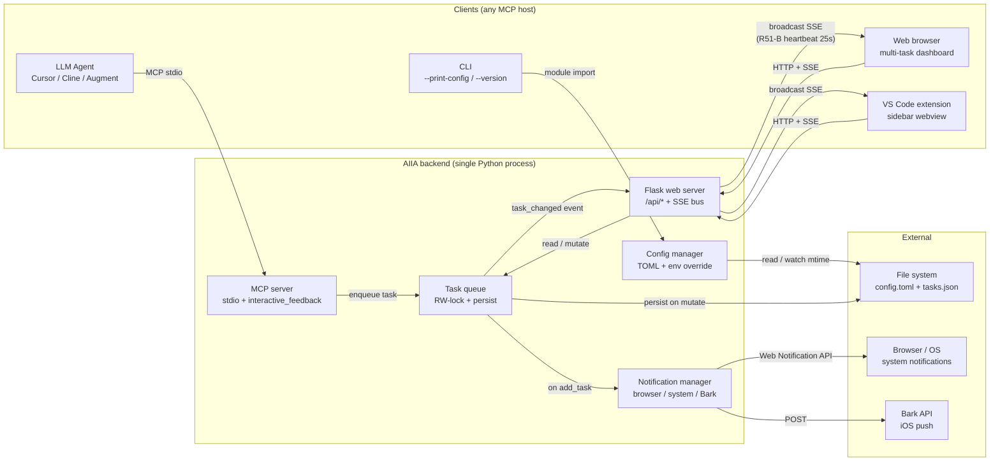
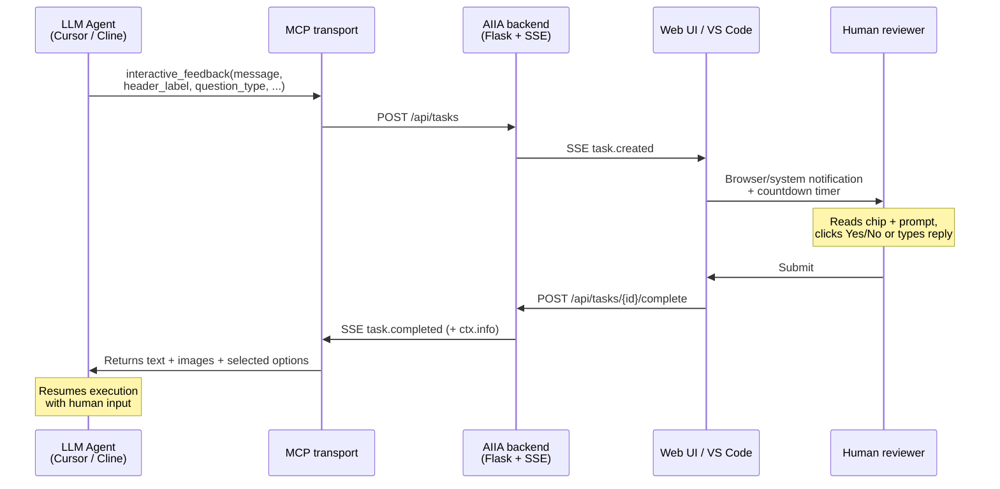
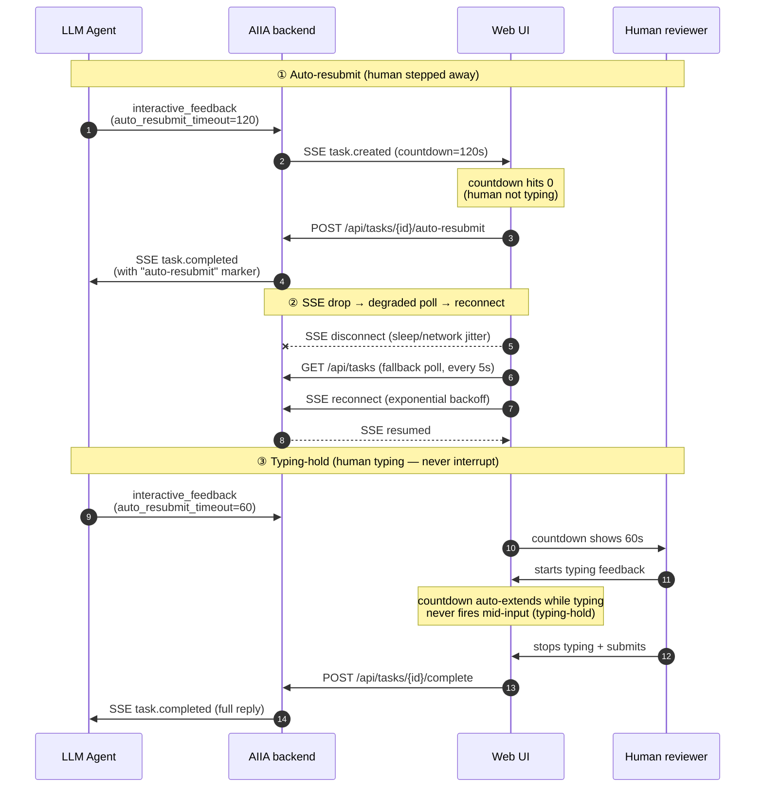

# Architecture

> 中文版：[`architecture.zh-CN.md`](architecture.zh-CN.md)

Component-level and workflow-level views of how AI Intervention Agent
(AIIA) fits together — useful when you're integrating a new client
(custom MCP host, alternate IDE plugin) or debugging a cross-component
issue.

## Architecture overview

**Key invariants** (locked by tests in `tests/`):

- `task_changed` SSE payload schema enforced cross-language
  (Python ↔ JS, `test_feat_sse_cross_language_schema_r297.py`).
- SSE heartbeat = 25s, cleanup interval = 5s, hot-path throttle = 30s,
  JS health check = 30s — locked across all source files
  (`test_feat_perf_baseline_const_r296.py`).
- Plus a static single-tool MCP surface, AST-based lock-acquisition-order
  contracts (deadlock-freedom proven statically), and a lazy-init audit —
  see [`contributor-guide-invariant-tests.md`](contributor-guide-invariant-tests.md)
  for the full catalogue.

For deeper subsystem detail (config schema, MCP tool reference, i18n
strategy, troubleshooting), start from the docs index:
[`README.md`](README.md).

## Agent / Glass mode workflow

AIIA is designed for **long-running autonomous agent loops** (Cursor
Composer, Cursor Glass mode, Cline, Augment, Trae) where the LLM calls
`interactive_feedback` many times during a single run. The combined
agent-side parameters + user-side UX features below let a human reviewer
decide in **< 5 seconds per task**, so the agent never blocks the
flow longer than necessary.

### How a single interaction flows

### Failure & recovery flows

Beyond the happy path above, three boundary cases keep long-running
Agent / Glass-mode sessions resilient: **auto-resubmit** (human steps
away), **SSE reconnect** (network drop), and **typing-hold** (human is
typing — never interrupt).

### Agent-side parameters (LLM passes these via MCP)

| Parameter | Purpose | Max | Source |
|---|---|---|---|
| `header_label` | One-word context chip in task pane (`Auth`, `DB`, `i18n`) | 16 chars | gemini-cli `ask_user.header` |
| `question_type='yesno'` | Hide textarea + render 2-button binary decision | — | gemini-cli `ask_user` |
| `feedback_placeholder` | Per-task textarea hint (overrides global i18n) | 200 chars | gemini-cli `ask_user` |
| `auto_resubmit_timeout` | Per-task countdown override (0 = disable) | `[0, 3600]` sec | AIIA native |
| `predefined_options` | Multi-select chips with optional `default: true` recommendation | 10000 chars/each | AIIA + upstream parity |
| `loop_id` + 4 loop fields | Group multi-round feedback into one loop: objective, phase, success criteria, iteration label | 32–500 chars | AIIA loop engineering |

Full parameter reference + a complete Agent-mode call example lives in
[`mcp_tools.md#agent-mode-parameters-cursor--composer--cline--augment--trae`](mcp_tools.md#agent-mode-parameters-cursor--composer--cline--augment--trae).

**Loop engineering** (long autonomous runs): rounds sharing a `loop_id`
render a loop-context strip above the prompt and a collapsible "Rounds"
timeline of every completed round's verdict, backed by `GET /api/loops`.
See [`mcp_tools.md#loop-engineering-parameters-long-autonomous-runs`](mcp_tools.md#loop-engineering-parameters-long-autonomous-runs).

### User-side workflow features (built into the Web UI)

- **Multi-task tabs** — parallel requests each get their own tab +
  independent countdown ring
- **Per-task draft autosave** — switching tabs never loses an
  in-progress reply
- **Typing-hold auto-extension** — the countdown extends itself while
  you type and never fires mid-input
- **Custom notification sound** — upload a short audio file for a
  distinct Agent-mode chime
- **Per-task images** — paste screenshots inline, returned to the agent
  as MCP `ImageContent` blocks
- **SSE liveness badge** — green/orange/red corner indicator shows
  whether the page is in sync

### Recommended LLM system prompt

To force the agent to actually use this tool instead of "auto-finishing"
the task, append the "Prompt snippet (copy/paste)" block from the
[project README](../README.md#quick-start) to your IDE's system prompt /
`.cursorrules`.
