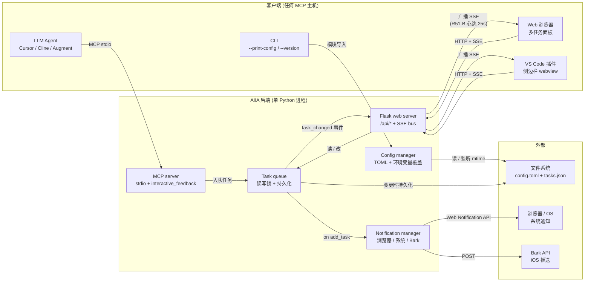
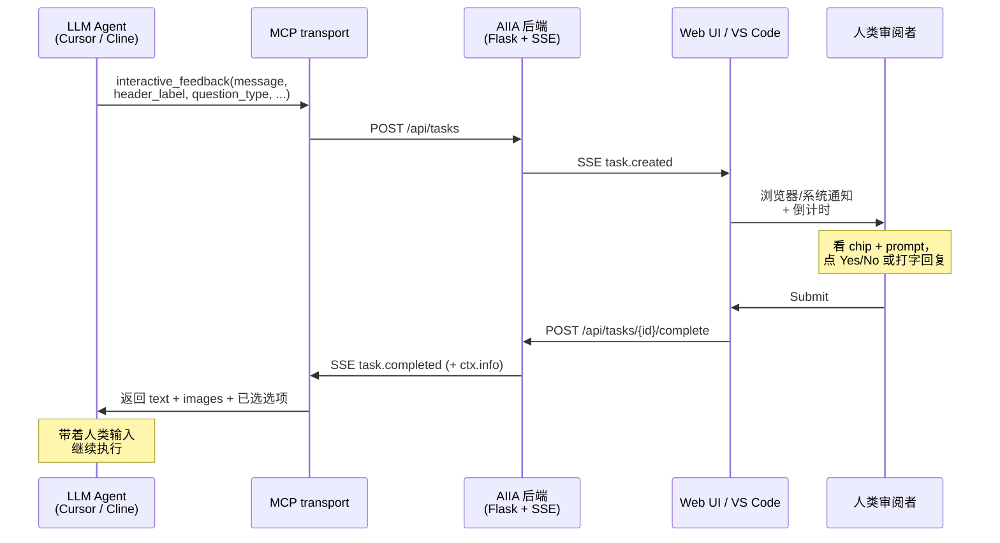
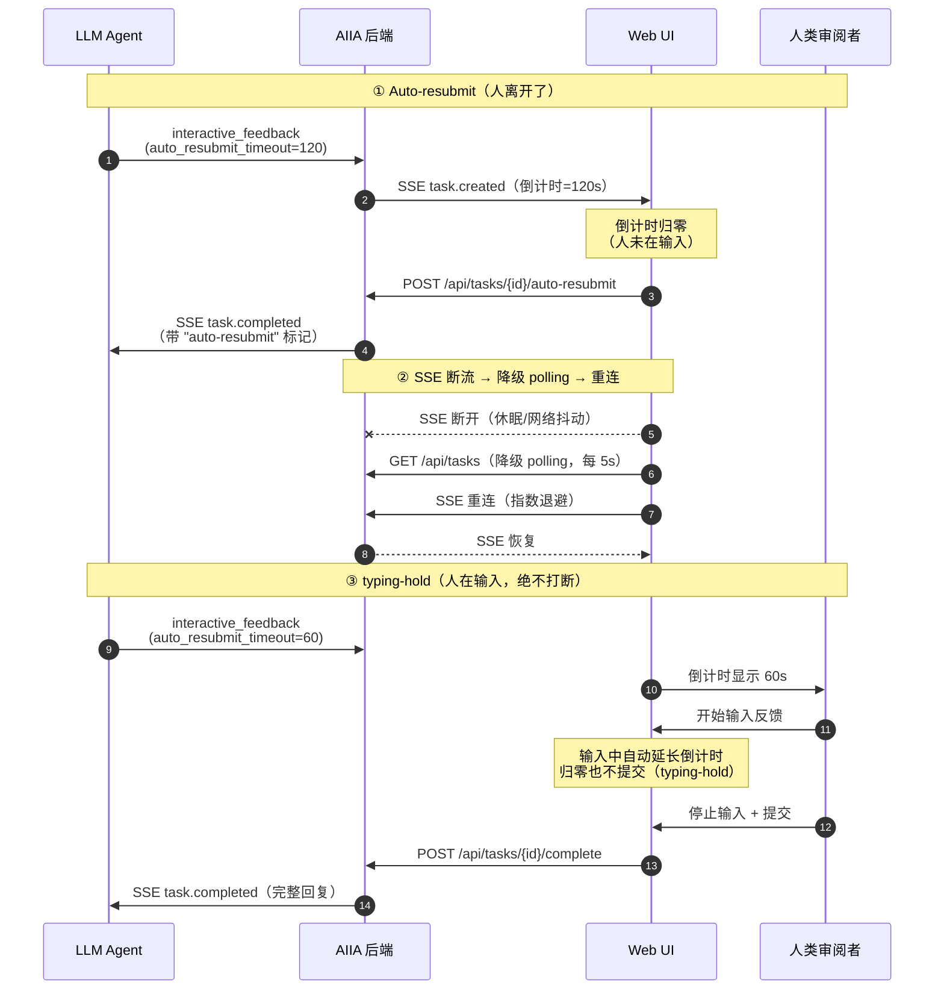

# 架构

> English version: [`architecture.md`](architecture.md)

从组件与工作流两个视角俯瞰 AI Intervention Agent（AIIA）各部分如何
拼接——在集成新客户端（自定义 MCP 主机、其他 IDE 插件）或定位跨组件
问题时特别有用。

## 架构总览

**关键不变量**（由 `tests/` 中的测试锁定）：

- `task_changed` SSE payload schema 跨语言强制
  （Python ↔ JS, `test_feat_sse_cross_language_schema_r297.py`）
- SSE 心跳 = 25s，清理间隔 = 5s，热路径节流 = 30s，JS 健康检查 = 30s
  —— 全 source 文件统一锁定
  （`test_feat_perf_baseline_const_r296.py`）
- 另有单一 MCP 工具接口、AST-based 锁获取顺序契约（静态证明无死锁环）、
  lazy-init 审计等——完整目录见
  [`contributor-guide-invariant-tests.zh-CN.md`](contributor-guide-invariant-tests.zh-CN.md)。

更深入的子系统细节（配置 schema、MCP 工具参考、i18n 策略、故障排查），
请从文档索引 [`README.zh-CN.md`](README.zh-CN.md) 进入。

## Agent / Glass 模式工作流

AIIA 专为**长时间运行的自主 agent 循环**（Cursor Composer、Cursor Glass
模式、Cline、Augment、Trae）设计——LLM 在单次运行内会反复调用
`interactive_feedback`。下面 agent 端参数 + 用户端 UX 特性组合在一起，
让人类审阅者**每个任务 < 5 秒**就能决策完，agent 永远不会被阻塞太久。

### 单次交互流转

### 异常路径 & 恢复流程

除了上面的正常路径外，三个边界场景让长时间 Agent / Glass 模式会话保持
韧性：**auto-resubmit**（人离开）、**SSE 重连**（网络断开）、
**typing-hold**（人在输入，绝不打断）。

### Agent 端参数（LLM 通过 MCP 传入）

| 参数 | 作用 | 上限 | 来源 |
|---|---|---|---|
| `header_label` | 任务面板上方的 1 词上下文 chip（`Auth`、`DB`、`i18n`） | 16 字符 | gemini-cli `ask_user.header` |
| `question_type='yesno'` | 隐藏文本框 + 渲染 2 按钮二元决策 | — | gemini-cli `ask_user` |
| `feedback_placeholder` | 每任务文本框 placeholder（覆盖全局 i18n） | 200 字符 | gemini-cli `ask_user` |
| `auto_resubmit_timeout` | 每任务倒计时覆盖（0 = 禁用） | `[0, 3600]` 秒 | AIIA 原生 |
| `predefined_options` | 多选 chip，可选 `default: true` 标记推荐项 | 10000 字符/条 | AIIA + 上游 parity |
| `loop_id` + 4 个 loop 字段 | 把多轮反馈串成一个循环：目标、阶段、完成标准、轮次标签 | 32–500 字符 | AIIA loop 工程 |

完整参数参考 + 综合调用示例见
[`mcp_tools.zh-CN.md#agent-模式专用参数cursor--composer--cline--augment--trae`](mcp_tools.zh-CN.md#agent-模式专用参数cursor--composer--cline--augment--trae)。

**Loop 工程**（长程自主循环）：携带同一 `loop_id` 的多轮任务会在
prompt 上方渲染 loop 上下文条，并提供可折叠的「历史轮次」时间线
（每轮的人类裁决摘要），数据来自 `GET /api/loops`。详见
[`mcp_tools.zh-CN.md#loop-工程参数长程自主循环`](mcp_tools.zh-CN.md#loop-工程参数长程自主循环)。

### 用户端工作流特性（内置在 Web UI）

- **多任务标签页** — 并发请求各自独立 tab + 独立倒计时圆环
- **每任务草稿自动保存** — 切换 tab 不丢正在输入的回复
- **输入即延长（typing-hold）** — 正在输入时倒计时自动延长、归零也
  绝不打断
- **自定义通知音效** — 上传短音频，让 Agent 模式任务有独特提示音
- **每任务图片** — 粘贴截图一起回复，作为 MCP `ImageContent` 块返回
  给 agent
- **SSE 实时连接徽章** — 角落 绿/橙/红 三态指示页面与后端是否同步

### 推荐 LLM 系统提示词

要让 agent 真的用这个工具而不是"自顾自结束任务"，把
[项目 README](../README.zh-CN.md#快速开始) 里「提示词（可复制）」整段
追加到你的 IDE 系统提示词 / `.cursorrules`。
